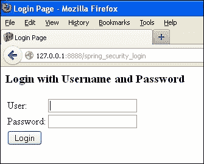

# 五、SpringSecurity 和 GWT

在本章中，我们将介绍：

*   使用 SpringSecurity bean 进行 GWT 身份验证的 SpringSecurity
*   使用 GWT 和 SpringSecurity的基于表单的身份验证
*   使用 GWT 和 SpringSecurity进行基本身份验证
*   使用 GWT 和 SpringSecurity进行摘要身份验证
*   使用 GWT 和 SpringSecurity进行数据库身份验证
*   使用 GWT 和 SpringSecurity的 LDAP 身份验证

# 导言

**Google web 开发工具包****GWT****为开发 java web 应用程序提供了标准框架。GWT 是为创建富 Internet 应用程序而开发的，如果您希望实现跨浏览器兼容性，它将是一个很好的选择。现代浏览器，例如 Mozilla 和 Chrome，提供了可以安装在所有浏览器上的 GWT 插件。有各种插件可用于不同的 IDE，包括 Eclipse、NetBeans 和其他许多 IDE。这些插件提高了开发速度。Eclipse 的 GWT 插件附带一个内部 Jetty 服务器，应用程序将自动部署在该服务器上。GWT 还减少了对 javascript 开发人员的依赖，因为 GWT 代码由 GWT-SDK 附带的 GWT 编译器转换为所有浏览器兼容的 javascript 和 HTML。**

 **在本章中，我们将使用各种方法演示 SpringSecurity与 GWT 集成。让我们首先为它做一个基本的设置。这一切都是关于下载插件和创建一个样例 GWT 项目。

# 使用 Spring Security Beans 进行 GWT 身份验证的 Spring Security

到目前为止，在我们之前的演示中，我们已经在`applicationContext.xml`文件中给出了配置。在下面的配方中，我们将采用不同的方法。在这种方法中，我们将看到如何使用身份验证提供者接口和 SpringSecurityAPI 中可用的身份验证接口来进行身份验证。

默认情况下，GWT 插件将创建一个问候语应用程序，该应用程序将通过接受用户名来问候用户。我们的目标是在此基础上应用安全性。我们希望在启动时用 SpringSecurity登录页面提示用户，然后将用户带到应用程序中。

## 准备好了吗

*   从[下载 Eclipse Indigohttp://dl.google.com/eclipse/plugin/3.7](http://dl.google.com/eclipse/plugin/3.7) 。
*   如果您使用的是另一个，请选择：[https://developers.google.com/eclipse/docs/download](https://developers.google.com/eclipse/docs/download) 。
*   在 Eclipse 中创建一个 gwtweb 项目，这将生成一个默认的 GWT 应用程序来迎接用户。
*   在任何 GWT 应用程序中，您都可以看到以下模块：
    *   **配置模块**：将有`gwt.xml`文件
    *   **客户端**：这将有两个接口异步接口和一个扩展*远程服务*接口的接口
    *   **服务器**：将具有`Implementation`类，该类实现客户端接口并扩展远程服务 Servlet
    *   **共享**：将有类用于检查数据验证
    *   **测试**：您可以在这里添加 junit 测试用例
    *   **War**：这将有`web-inf`文件夹
*   在内部服务器上运行应用程序。您将获得一个 URL。
*   在 Mozilla Firefox 浏览器中打开 URL；您将得到一个下载并安装 GWT 插件的提示。
*   系统将提示您输入用户名，输入后，您将看到一个对话框，其中将提供用户详细信息。
*   我们的目标是在应用程序启动时应用安全性，也就是说，我们希望识别正在访问 GWT 应用程序的用户。
*   创建一个`applicationContext.xml`文件。必须将其命名为`applicationContext`，否则我们将在控制台中收到错误消息。
*   使用 spring 监听器编辑`web.xml`文件。
*   使`sure`文件夹具有以下 JAR 文件：
    *   `gwt-servlet`
    *   `spring-security-config-3.1.4.Release`
    *   `spring-security-core-3.1.4.Release`
    *   `spring-security-web-3.1.4.Release`
    *   `org.spring-framework.core-3.1.4.Release`
    *   `org.spring-framework.context.support-3.1.4.Release`
    *   `org.springframework.context-3.1.4.Release`
    *   `org.springframework.expression-3.1.4.Release`
    *   `org.springframework.aop-3.1.4.Release`
    *   `org.springframework.aspects-3.1.4.Release`
    *   `org.springframework.asm-3.1.4.Release`
    *   `org.springframework.web-3.1.4.Release`
    *   `org.springframework.web.servelet-3.1.4.Release`
    *   `org.springframework.instrument-3.1.4.Release`
    *   `org.springframework.instrument-tomcat-3.1.4.Release`

## 怎么做。。。

1.  Update the `Web.xml` file with Spring Listener and Spring Filter:

    ```java
    <filter>
      <filter-name>springSecurityFilterChain</filter-name>
      <filter-class>org.springframework.web.filter.DelegatingFilterProxy</filter-class>
    </filter>

    <filter-mapping>
      <filter-name>springSecurityFilterChain</filter-name>
      <url-pattern>/*</url-pattern>
    </filter-mapping>

    <listener>
      <listener-class>
      org.springframework.web.context.ContextLoaderListener
      </listener-class>
    </listener>
    ```

    您可以看到，我们没有像在以前的应用程序中那样配置`<context-param>`。Spring 将自动查找`applicationContext.xml`文件。

2.  Edit the `applicationContext.xml` file:

    ```java
    <http auto-config="true">
      <intercept-url pattern="/xyz/**" access="ROLE_AUTHOR"/>
      <intercept-url pattern="/xyz/**" access="ROLE_AUTHOR"/>
      <intercept-url pattern="/**/*.html" access="ROLE_AUTHOR"/>
      <intercept-url pattern="/**" 
        access="IS_AUTHENTICATED_ANONYMOUSLY" />
    </http>
    <beans:bean id="packtAuthenticationListener" 
      class="com.demo.xyz.server.PacktAuthenticationListener"/>
    <beans:bean id="packtGWTAuthenticator" 
      class="com.demo.xyz.server.PacktGWTAuthenticator" />    
    <authentication-manager alias="authenticationManager">
      <authentication-provider ref="packtGWTAuthenticator"/>
    </authentication-manager>
    </beans:beans>
    ```

    此配置还将为后续步骤提供提示。您可以看到我们没有配置任何`<login-page>`或其 URL。我们只提供了需要安全性的 URL。`<authentication-provider>`映射了一个自定义类。

    我们还配置了两个 bean，它们是侦听器和验证器。

    Spring 的上下文 API 允许我们创建侦听器来跟踪应用程序中的事件。如果您还记得，我们在 JSF 应用程序中还使用了侦听器阶段侦听器来跟踪与安全相关的事件和错误。

    `PacktGWTAuthenticator`实现认证提供者接口。

3.  Create an authenticator using the Spring authentication provider:

    ```java
    Package com.demo.xyz.server
    public class PacktGWTAuthenticator implements AuthenticationProvider{
      static Users users=new Users();
      private static Map<String, String> usersMap =users.loadUsers();

      @Override
      public Authentication authenticate
        (Authentication authentication) 
      throws AuthenticationException {

        String mylogin_name = (String) authentication.getPrincipal();
        String mypassword = (String)authentication.getCredentials();
        //check username
        if (usersMap.get(mylogin_name)==null)
        throw new UsernameNotFoundException
          (mylogin_name+"credential not found in the UsersMap");
    //get password
        String password = usersMap.get(mylogin_name);

        if (!password.equals(mypassword))
          throw new BadCredentialsException("Incorrect password-
            or credential not found in the UsersMap");

          Authentication packtauthenticator =  new 
            PacktGWTAuthentication("ROLE_AUTHOR", authentication);
          packtauthenticator .setAuthenticated(true);

          return packtauthenticator;

        }

        @Override
        public boolean supports(Class<? extends Object>
           authentication) {
        return UsernamePasswordAuthenticationToken.class
          .isAssignableFrom(authentication);
      }
    }
    ```

    这里，`authenticate ()`和`supports ()`是认证提供者接口方法。用户类将加载用户。

4.  Create a `User` class to load the users:

    ```java
    package com.demo.xyz.server;
    import java.util.HashMap;
    import java.util.Map;
    public class Users {
      public Map<String, String> getUsersMap() {
        return usersMap;
      }

      public void setUsersMap(Map<String, String> usersMap) {

        this.usersMap = usersMap;
      }

      private Map<String, String> usersMap = new HashMap
        <String, String>();

      public Map<String, String> loadUsers(){
        usersMap.put("rashmi", "rashmi123");
        usersMap.put("shami", "shami123");
        usersMap.put("ravi", "ravi123");
        usersMap.put("ratty", "ratty123");
        return usersMap;
      }

    }
    ```

    上面的类几乎没有 getter 和 setter。以及加载用户的方法。

5.  Implementing the Spring authentication class to get the user information:

    ```java
    public class PacktGWTAuthentication implements Authentication{

      private static final long serialVersionUID = -3091441742758356129L;

      private boolean authenticated;

      private GrantedAuthority grantedAuthority;
      private Authentication authentication;

      public PacktGWTAuthentication(String role, Authentication authentication) {
        this.grantedAuthority = new GrantedAuthorityImpl(role);
        this.authentication = authentication;
      }

      @Override
      public Object getCredentials() {
        return authentication.getCredentials();
      }

      @Override
      public Object getDetails() {
        return authentication.getDetails();
      }

      @Override
      public Object getPrincipal() {
        return authentication.getPrincipal();
      }

      @Override
      public boolean isAuthenticated() {
        return authenticated;
      }

      @Override
      public void setAuthenticated(boolean authenticated)throws IllegalArgumentException {
        this.authenticated = authenticated;
      }

      @Override
      public String getName() {
        return this.getClass().getSimpleName();
      }
      @Override
      public Collection<GrantedAuthority> getAuthorities() {
        Collection<GrantedAuthority> authorities = new ArrayList<GrantedAuthority>();
        authorities.add(granted Authority);
        return authorities;
      }

    }
    ```

    身份验证接口处理用户详细信息、主体和凭据。身份验证提供程序使用此类传递角色信息。

6.  Implement the interfaces declared in the GWT client package:

    ```java
    package com.demo.xyz.server;
    public class PacktAuthenticatorServiceImpl extends RemoteServiceServlet  implements PacktAuthenticatorService {

      @Override
      public String authenticateServer() {
      Authentication authentication =SecurityContextHolder.getContext().getAuthentication();
      if (authentication==null){
        System.out.println("looks like you have not logged in.");
        return null;
      }
      else {
        System.out.println(authentication.getPrincipal().toString());
        System.out.println(authentication.getName().toString());
        System.out.println(authentication.getDetails().toString());
        return (String) authentication.getPrincipal();
        }

      }

    }
    ```

    `authenticate Server`方法实现在该类中找到。此将打印调试语句以检查用户是否登录。如果登录，那么我们必须获取主体和用户的详细信息。

7.  Use the Spring listeners to track events:

    ```java
    package com.demo.xyz.server;
    public class PacktAuthenticationListener implements 
      ApplicationListener<AbstractAuthenticationEvent>{
      @Override
      public void onApplicationEvent
        (AbstractAuthenticationEvent event) {

        final StringBuilder mybuilder = new StringBuilder();
        mybuilder.append("AN AUHTHENTICATION EVENT ");
        mybuilder.append(event.getClass().getSimpleName());
        mybuilder.append("*** ");
        mybuilder.append(event.getAuthentication().getName());
        mybuilder.append("$$$DETAILS OF THE EVENT: ");
        mybuilder.append(event.getAuthentication().getDetails());

        if (event instanceof 
          AbstractAuthenticationFailureEvent) {
          mybuilder.append("$$$ EXCEPTION HAS OCCURED: ");
          mybuilder.append(((AbstractAuthenticationFailureEvent)
           event).getException().getMessage());
        }
        System.out.println(mybuilder.toString());
      }
    }
    ```

    此类实现了类型为`AbstractAuthenticationEvent`的 Springs 应用程序侦听器。我们正在捕获身份验证事件并在控制台中打印出来；您还可以使用记录器跟踪此类事件。

8.  Update the GWT class on `ModuleLoad()`:

    ```java
    package com.demo.xyz.client;

    /**
     * Entry point classes define <code>onModuleLoad()</code>.
     */
    public class Xyz implements EntryPoint {
    /**
     * The message displayed to the user when the server cannot be reached or
     * returns an error.
     */
    private static final String SERVER_ERROR = 
      "An error occurred while "+ "attempting to contact
       the server. Please check your network "
      + "connection and try again.";

    /**
     * Create a remote service proxy to talk to the server-side Greeting service.
     */
    private final GreetingServiceAsync greetingService = 
      GWT.create(GreetingService.class);
    private final PacktAuthenticatorServiceAsync 
      packtAuthenticatorService = 
      GWT.create(PacktAuthenticatorService.class);
    /**
     * This is the entry point method.
     */
    public void onModuleLoad() {
      final Button sendButton = new Button("Send");
      final TextBox nameField = new TextBox();
      nameField.setText("GWT User");
      final Label errorLabel = new Label();
      sendButton.addStyleName("sendButton");
      RootPanel.get("nameFieldContainer").add(nameField);
      RootPanel.get("sendButtonContainer").add(sendButton);
      RootPanel.get("errorLabelContainer").add(errorLabel);

    // Focus the cursor on the name field when the app loads
      nameField.setFocus(true);
      nameField.selectAll();

      // Create the popup dialog box
      final DialogBox dialogBox = new DialogBox();
      dialogBox.setText("Remote Procedure Call");
      dialogBox.setAnimationEnabled(true);
      final Button closeButton = new Button("Close");
    // We can set the id of a widget by accessing its Element
      closeButton.getElement().setId("closeButton");
      final Label textToServerLabel = new Label();
      final HTML serverResponseLabel = new HTML();
      VerticalPanel dialogVPanel = new VerticalPanel();
      dialogVPanel.addStyleName("dialogVPanel");
      dialogVPanel.add(new HTML
        ("<b>Sending name to the server:</b>"));
      dialogVPanel.add(textToServerLabel);
      dialogVPanel.add(new HTML("<br><b>Server replies:</b>"));
      dialogVPanel.add(serverResponseLabel);
      dialogVPanel.setHorizontalAlignment
        (VerticalPanel.ALIGN_RIGHT);
    dialogVPanel.add(closeButton);
    dialogBox.setWidget(dialogVPanel);

      // Add a handler to close the DialogBox
      closeButton.addClickHandler(new ClickHandler() {
        public void onClick(ClickEvent event) {
          dialogBox.hide();
          sendButton.setEnabled(true);
          sendButton.setFocus(true);
        }
      });

      // Create a handler for the sendButton and nameField
      class MyHandler implements ClickHandler, KeyUpHandler {

      public void onClick(ClickEvent event) {
        sendNameToServer();
      }

      public void onKeyUp(KeyUpEvent event) {
        if (event.getNativeKeyCode() == KeyCodes.KEY_ENTER) {
          sendNameToServer();
        }
      }

      /**
       * Send the name from the nameField to the server and wait for a response.
       */
      private void sendNameToServer() {
      // First, we validate the input.
      errorLabel.setText("");
      String textToServer = nameField.getText();
      if (!FieldVerifier.isValidName(textToServer)) {
        errorLabel.setText("Please enter at least four 
          characters");
        return;
        }

    // Then, we send the input to the server.
        sendButton.setEnabled(false);
        textToServerLabel.setText(textToServer);
        serverResponseLabel.setText("");
        greetingService.greetServer(textToServer,
        new AsyncCallback<String>() {
          public void onFailure(Throwable caught) {
            // Show the RPC error message to the user dialogBox
            setText("Remote Procedure Call - Failure");
            serverResponseLabel.addStyleName
              ("serverResponseLabelError");
            serverResponseLabel.setHTML(SERVER_ERROR);
            dialogBox.center();
            closeButton.setFocus(true);
          }

          public void onSuccess(String result) {
            dialogBox.setText("Remote Procedure Call");
            serverResponseLabel.removeStyleName
              ("serverResponseLabelError");
            serverResponseLabel.setHTML(result);
            dialogBox.center();
            closeButton.setFocus(true);
          }
        });
      }
    }

    // Add a handler to send the name to the server
    MyHandler handler = new MyHandler();
    sendButton.addClickHandler(handler);
    nameField.addKeyUpHandler(handler);
    packtAuthenticatorService.authenticateServer(new AsyncCallback<String>() {
      public void onFailure(Throwable caught) {
        dialogBox.setText("Remote Procedure Call - Failure");
      }
      public void onSuccess(String result) {
        nameField.setText(result);
      }
    }
    );
    }
    }
    ```

    在`onModuleLoad`方法末尾添加此代码。这类似于在加载时注册我们的服务。

9.  编辑的`PacktAuthenticationService`类：

    ```java
    package com.demo.xyz.client;

    /**
    * Entry point classes define <code>onModuleLoad()</code>.
    */
    public class Xyz implements EntryPoint {
      /**
       * The message displayed to the user when the server cannot be reached or
       * returns an error.
       */
      private static final String SERVER_ERROR = 
        "An error occurred while "+ "attempting to contact
         the server. Please check your network "
        + "connection and try again.";

      /**
       * Create a remote service proxy to talk to the server-side Greeting service.
       */
      private final GreetingServiceAsync greetingService
         = GWT.create(GreetingService.class);
      private final PacktAuthenticatorServiceAsync 
        packtAuthenticatorService = 
        GWT.create(PacktAuthenticatorService.class);
      /**
       * This is the entry point method.
       */
      public void onModuleLoad() {
        final Button sendButton = new Button("Send");
        final TextBox nameField = new TextBox();
        nameField.setText("GWT User");
        final Label errorLabel = new Label();

        // We can add style names to widgets
        sendButton.addStyleName("sendButton");

        // Add the nameField and sendButton to the RootPanel
        // Use RootPanel.get() to get the entire body element
        RootPanel.get("nameFieldContainer").add(nameField);
        RootPanel.get("sendButtonContainer").add(sendButton);
        RootPanel.get("errorLabelContainer").add(errorLabel);

        // Focus the cursor on the name field when the app loads nameField.setFocus(true);
        nameField.selectAll();

        // Create the popup dialog box
        final DialogBox dialogBox = new DialogBox();
        dialogBox.setText("Remote Procedure Call");
        dialogBox.setAnimationEnabled(true);
        final Button closeButton = new Button("Close");
        //We can set the id of a widget by accessing its Element
        closeButton.getElement().setId("closeButton");
        final Label textToServerLabel = new Label();
        final HTML serverResponseLabel = new HTML();
        VerticalPanel dialogVPanel = new VerticalPanel();
        dialogVPanel.addStyleName("dialogVPanel");
        dialogVPanel.add(new HTML
          ("<b>Sending name to the server:</b>"));
        dialogVPanel.add(textToServerLabel);
        dialogVPanel.add(new HTML("<br><b>Server replies:</b>"));
        dialogVPanel.add(serverResponseLabel);
        dialogVPanel.setHorizontalAlignment
          (VerticalPanel.ALIGN_RIGHT);
        dialogVPanel.add(closeButton);
        dialogBox.setWidget(dialogVPanel);

        // Add a handler to close the DialogBox
        closeButton.addClickHandler(new ClickHandler() {
          public void onClick(ClickEvent event) {
            dialogBox.hide();
            sendButton.setEnabled(true);
            sendButton.setFocus(true);
          }
        });

        // Create a handler for the sendButton and nameField
        class MyHandler implements ClickHandler, KeyUpHandler {
          /**
           * Fired when the user clicks on the sendButton.
           */
          public void onClick(ClickEvent event) {
            sendNameToServer();
          }

          /**
           * Fired when the user types in the nameField.
           */
          public void onKeyUp(KeyUpEvent event) {
            if (event.getNativeKeyCode() == KeyCodes.KEY_ENTER) {
              sendNameToServer();
            }
          }

            /**
             * Send the name from the nameField to the server and wait for a response.
             */
            private void sendNameToServer() {
            // First, we validate the input.
            errorLabel.setText("");
            String textToServer = nameField.getText();
            if (!FieldVerifier.isValidName(textToServer)) {
              errorLabel.setText("Please enter at least
                 four characters");
              return;
            }

            // Then, we send the input to the server.
            sendButton.setEnabled(false);
            textToServerLabel.setText(textToServer);
            serverResponseLabel.setText("");
            greetingService.greetServer(textToServer,
            new AsyncCallback<String>() {
              public void onFailure(Throwable caught) {
                // Show the RPC error message to the user
              dialogBox.setText("Remote Procedure Call
                 - Failure");
              serverResponseLabel.addStyleName
                ("serverResponseLabelError");
              serverResponseLabel.setHTML(SERVER_ERROR);
              dialogBox.center();
              closeButton.setFocus(true);
            }

            public void onSuccess(String result) {
            dialogBox.setText("Remote Procedure Call");
            serverResponseLabel.removeStyleName
              ("serverResponseLabelError");
            serverResponseLabel.setHTML(result);
            dialogBox.center();
            closeButton.setFocus(true);
          }
        });
      }
    }

    // Add a handler to send the name to the server
    MyHandler handler = new MyHandler();
    sendButton.addClickHandler(handler);
    nameField.addKeyUpHandler(handler);
    packtAuthenticatorService.authenticateServer(new AsyncCallback<String>() {
      public void onFailure(Throwable caught) {
      dialogBox.setText("Remote Procedure Call - Failure");
    }
    public void onSuccess(String result) {
      nameField.setText(result);
    }
    }
    );
    }
    }
    ```

## 它是如何工作的。。。

现在进入以下 URL：

`http://127.0.0.1:8888/Xyz.html?gwt.codesvr=127.0.0.1:9997`

用户将被重定向到 Spring Security 内部登录页面。当用户输入**用户**和**密码**输入并点击提交时，`PacktGWTAuthenticator`类从`Users`类加载用户并比较输入。如果映射与用户提供的凭据相同，则启动授权，成功后，将用户定向到 GWT 应用程序。示例通过实现接口显式使用了 Spring Security 的`Authentication Provider`和`Authenticator Bean`类，`application-context.xml`调用`PacktGWTAuthenticator`和`PacktGWTAuthentication implementation`类进行身份验证和授权。




您将在成功登录时看到上一个图像。

监听器在 Eclipse 控制台的中生成输出：

```java
PacktGWTAuthentication
org.springframework.security.web.authentication.WebAuthenticationDetails@fffdaa08: RemoteIpAddress: 127.0.0.1; SessionId: 1cdb5kk395o29

```

登录失败时，将显示以下图像：


## 另见

*   基于 GWT 和 Spring Security 的*表单身份验证*配方
*   使用 GWT 和 Spring Security 的*基本身份验证*配方
*   GWT 和 Spring Security 的*摘要认证*配方
*   使用 GWT 和 Spring Security 的*数据库身份验证*配方
*   使用 GWT 和 Spring Security 的*LDAP 身份验证*配方

# 使用 GWT 和 Spring Security 的基于表单的身份验证

我们将在 GWT 中演示基于表单的身份验证。这与我们在之前的食谱中所做的认证非常相似。我们将编辑`applicationContext.xml`。

## 准备好了吗

*   创建一个示例 GWT 项目。
*   在构建路径中添加与 spring 相关的 JAR。
*   添加与 SpringSecurity相关的 JAR。
*   添加`applicationContext.xml`文件。
*   如前一节所示编辑`web.xml`文件。
*   同时在`web-inf lib`文件夹中添加与 spring 相关的 JAR。

## 怎么做。。。

编辑`applicationContext.xml`文件：

```java
<http auto-config="true" >
  <intercept-url pattern="/basicgwtauth/**"
     access="ROLE_AUTHOR"/>
        <intercept-url pattern="/basicgwtauth/**" access="ROLE_AUTHOR"/>
        <intercept-url pattern="/**/*.html" access="ROLE_AUTHOR"/>
        <intercept-url pattern="/**" access="IS_AUTHENTICATED_ANONYMOUSLY" />

</http>
<authentication-manager>
  <authentication-provider>
    <user-service>
      <user name="anjana" password="123456" 
      authorities="ROLE_AUTHOR" />
    </user-service>
  </authentication-provider>
</authentication-manager>
```

此配置调用内部 SpringSecurity登录表单。这个想法是展示另一个场景，其中我们没有指定身份验证机制，spring 默认使用其登录表单页面对用户进行身份验证。

## 它是如何工作的。。。

现在访问以下 URL：

`http://127.0.0.1:8888/Basicgwtauth.html?gwt.codesvr=127.0.0.1:9997`


输入登录用户名和密码；您将被带到 GWT 页面。如果开发人员不想创建自己的定制 jsp，这也是一种调用 spring 内部登录 jsp 页面的机制。它仍然会读取提供给用户进行身份验证和授权的身份验证提供程序详细信息。

通过类似的方式，您可以使用数据库和 LDAP 进行身份验证，也可以编辑身份验证管理器配置。

## 另见

*   使用 GWT 和 Spring Security 的*基本身份验证*配方
*   GWT 和 Spring Security 的*摘要认证*配方
*   使用 GWT 和 Spring Security 的*数据库身份验证*配方
*   使用 GWT 和 Spring Security 的*LDAP 身份验证*配方

# 使用 GWT 和 Spring Security 进行基本身份验证

我们将在 GWT 中演示基本身份验证。这与我们在之后的食谱中所做的基本认证非常相似。我们将编辑`applicationContext.xml`。

## 准备好了吗

*   创建一个示例 GWT 项目
*   在构建路径中添加与 spring 相关的 JAR
*   添加与 SpringSecurity相关的 JAR
*   添加`applicationContext.xml`文件
*   如前一节所示编辑`web.xml`文件
*   同时在`web-inf lib`文件夹中添加与弹簧相关的罐子

## 怎么做。。。

编辑`applicationContext.xml`文件：

```java
<http auto-config="true" >
  <intercept-url pattern="/basicgwtauth/**"
     access="ROLE_AUTHOR"/>
  <intercept-url pattern="/basicgwtauth/**"
     access="ROLE_AUTHOR"/>
  <intercept-url pattern="/**/*.html" access="ROLE_AUTHOR"/>
  <intercept-url pattern="/**"
     access="IS_AUTHENTICATED_ANONYMOUSLY" />
  <http-basic />
</http>
<authentication-manager>
  <authentication-provider>
    <user-service>
      <user name="anjana" password="123456" 
        authorities="ROLE_AUTHOR" />
    </user-service>
  </authentication-provider>
</authentication-manager>
```

这里我们将认证机制指定为基本机制。

## 它是如何工作的。。

现在访问 URL:

`http://127.0.0.1:8888/Basicgwtauth.html?gwt.codesvr=127.0.0.1:9997`

SpringSecurity将中断用户访问 GWT 应用程序。安全机制将从`application-context.xml`文件中读取。对于此应用程序，安全机制是基本的。SpringSecurity 将弹出一个对话框，询问用户名和密码。用户输入的登录用户名和密码将经过身份验证和授权，用户将进入 GWT 页面。


输入登录用户名和密码，进入 GWT 页面。

## 另见

*   GWT 和 Spring Security 的*摘要认证*配方
*   使用 GWT 和 Spring Security 的*数据库身份验证*配方
*   使用 GWT 和 Spring Security 的*LDAP 身份验证*配方

# 使用 GWT 和 Spring Security 进行摘要身份验证

我们现在将在 GWT 中演示摘要身份验证。这与我们在之前的配方中所做的基本认证非常相似。我们将编辑`applicationContext.xml`。我们将对密码进行哈希运算。设置保持不变，唯一的变化是`applicationcontext.xml`。

## 准备好了吗

*   创建一个示例 GWT 项目
*   在构建路径中添加与 spring 相关的 JAR
*   添加与 SpringSecurity相关的 JAR
*   添加`applicationContext.xml`文件
*   如前一节所示编辑`web.xml`文件
*   同时在`web-inf lib`文件夹中添加与弹簧相关的罐子

## 怎么做。。。

编辑`applicationContext.xml`文件：

```java
<http auto-config="true" >
  <intercept-url pattern="/basicgwtauth/**" access="
     ROLE_EDITOR "/>
  <intercept-url pattern="/basicgwtauth/**" access="
     ROLE_EDITOR "/>
  <intercept-url pattern="/**/*.html" access=
    " ROLE_EDITOR "/>
  <intercept-url pattern="/**" access
    ="IS_AUTHENTICATED_ANONYMOUSLY" />
  <http-basic />
</http>
<authentication-manager>
  <authentication-provider>
    <password-encoder hash="sha" />
    <user-service>
      <user name="anjana" 
        password="bde892ed4e131546a2f9997cc94d31e2c8f18b2a" 
      authorities="ROLE_EDITOR" />
    </user-service>
  </authentication-provider>
</authentication-manager>
```

这里我们将身份验证机制指定为基本机制，并在这里给出了哈希密码。要散列密码，请使用`jacksum jar`。这已在[第 2 章](02.html "Chapter 2. Spring Security with Struts 2")*中说明，Sturts2*的SpringSecurity。

## 它是如何工作的。。。

现在访问以下 URL：

`http://127.0.0.1:8888/Basicgwtauth.html?gwt.codesvr=127.0.0.1:9997`

应该通过访问此 URL 将用户重定向到 GWT 应用程序。但是 Spring 框架会中断此操作，以检查用户是否有权查看应用程序。它会弹出一个登录屏幕。输入登录用户名和密码，您将进入 GWT 页面。

您的密码将根据配置文件中提到的算法进行解码以进行身份验证。这里提到的算法是*Sha*。因此密码将使用*Sha 算法*进行加密和解密。


输入登录用户名和密码，您将进入 GWT 页面。您的密码将根据配置文件中提到的算法进行解码以进行身份验证。

## 另见

*   使用 GWT 和 Spring Security 的*数据库身份验证*配方
*   使用 GWT 和 Spring Security 的*LDAP 身份验证*配方

# 使用 GWT 和 Spring Security 进行数据库身份验证

我们将在 GWT 中演示数据库身份验证。设置保持不变。在前面的所有示例中，我们都使用了`applicationContext.xml`，Spring 框架很容易识别它，因为它有默认文件名。在本例中，我们将为其提供一个新的文件名称，并查看应用程序如何响应。另外，我们需要添加`spring-jdbc.xml`。

## 准备好了吗

*   创建一个示例 GWT 项目
*   在构建路径中添加与 spring 相关的 JAR
*   添加与 SpringSecurity相关的 JAR
*   添加`spring-security.xml`文件
*   添加与 SpringJDBC 相关的 JAR
*   如前一节所示编辑`web.xml`文件
*   同时在`web-inf lib`文件夹中添加与弹簧相关的罐子

## 怎么做。。。

编辑`spring-security.xml`文件：

```java
<http auto-config="true" >
  <intercept-url pattern="/springgwtdbsecurity/**"
     access="ROLE_AUTHOR"/>
  <intercept-url pattern="/springgwtdbsecurity/**"
     access="ROLE_AUTHOR"/>
  <intercept-url pattern="/**/*.html" access="ROLE_AUTHOR"/>
  <intercept-url pattern="/**"
     access="IS_AUTHENTICATED_ANONYMOUSLY" />
  <http-basic />
</http>
<authentication-manager alias="authenticationManager">
  <authentication-provider>
  <jdbc-user-service data-source-ref="dataSource"
  users-by-username-query="
  select username,password, enabled 
  from users where username=?" 

  authorities-by-username-query="
  select u.username, ur.authority from users u,
     user_roles ur 
        where u.user_id = ur.user_id and u.username =?"/>
  </authentication-provider>
</authentication-manager>
```

将上面的添加到`xml`文件的 bean 标记中。这里我们将认证机制指定为基本机制，用户信息存储在数据库中。

编辑`spring-jdbc.xml`文件：

```java
<beans 
  xmlns:xsi="http://www.w3.org/2001/XMLSchema-instance"
  xsi:schemaLocation="http://www.springframework.org/
    schema/beans
  http://www.springframework.org/schema/beans/
    spring-beans-3.0.xsd">

  <bean id="MySqlDatasource" class="org.springframework.
    jdbc.datasource.DriverManagerDataSource">
    <property name="driverClassName" value=
      "com.mysql.jdbc.Driver" />
    <property name="url" value=
      "jdbc:mysql://localhost:3306/packtdb" />
    <property name="username" value="root" />
  <property name="password" value="packt123" />
  </bean>
</beans>
```

我们正在提供数据库信息。

编辑`web.xml`文件：

```java
<context-param>
  <param-name>contextConfigLocation</param-name>
  <param-value>
    /WEB-INF/spring-security.xml,
    /WEB-INF/spring-jdbc.xml
  </param-value>
</context-param>

<listener>
  <listener-class>
    org.springframework.web.context.ContextLoaderListener
  </listener-class>
</listener>
```

我们必须配置`springsecurityFilterchain`，如前面的示例所示，并在下面添加上述部分。

## 它是如何工作的。。。

现在访问以下 URL：

`http://127.0.0.1:8888/springgwtdbsecurity.html?gwt.codesvr=127.0.0.1:9997`

输入登录用户名和密码，您将进入 GWT 页面。将创建数据库连接并执行查询。将使用检索到的值检查用户输入的值以进行身份验证。通过这一点，我们可以看到 GWT 与 Spring Security 无缝集成。

## 另见

*   使用 GWT 和 Spring Security 的*LDAP 身份验证*配方

# 使用 GWT 和 Spring Security 的 LDAP 身份验证

我们将在 GWT 中演示 LDAP 身份验证。设置保持不变：用户必须创建组和用户。

## 准备好了吗

*   创建一个示例 GWT 项目
*   在构建路径中添加与 spring 相关的 JAR
*   添加与 SpringSecurity相关的 JAR
*   添加`spring-security.xml`文件
*   添加与 SpringLDAP 相关的 JAR
*   如前一节所示编辑`web.xml`文件
*   同时在`web-inf lib`文件夹中添加与弹簧相关的罐子

## 怎么做。。。

编辑`spring-security.xml`文件：

```java
<http auto-config="true" >
  <intercept-url pattern="/springgwtldapsecurity/**"
     access="ROLE_AUTHOR"/>
  <intercept-url pattern="/springgwtldapsecurity/**"
     access="ROLE_AUTHOR"/>
  <intercept-url pattern="/**/*.html" access="ROLE_AUTHOR"/>
  <intercept-url pattern="/**"
     access="IS_AUTHENTICATED_ANONYMOUSLY" />
  <http-basic />
</http>
<authentication-manager>
  <ldap-authentication-provider 
    user-search-filter="(mail={0})" 
    user-search-base="ou=people"
    group-search-filter="(uniqueMember={0})"
    group-search-base="ou=groups"
    group-role-attribute="cn"
    role-prefix="ROLE_">
    </ldap-authentication-provider>
  </authentication-manager>

<ldap-server url="ldap://localhost:389/o=example"
   manager-dn="uid=admin,ou=system"
   manager-password="secret" />
```

在 xml 的`beans`标记中添加此代码。这里我们将身份验证机制指定为基本机制，用户信息存储在 LDAP 服务器上。

编辑`web.xml`文件：

```java
<context-param>
  <param-name>contextConfigLocation</param-name>
  <param-value>
    /WEB-INF/spring-security.xml
  </param-value>
</context-param>

<listener>
  <listener-class>
    org.springframework.web.context.ContextLoaderListener
  </listener-class>
</listener>
```

我们必须按照前面的示例配置`springsecurityFilterchain`。

## 它是如何工作的。。。

现在访问以下 URL：

`27.0.0.1:8888/springgwtldapsecurity.html?gwt.codesvr=127.0.0.1:9997`

输入登录用户名和密码，您将进入 GWT 页面。Spring 将使用`<ldap-server>`标记中提供的详细信息来访问 OpenLDAP。springsecurityldap 将与 openldap 对话，用户输入的值将与检索到的值一起检查以进行身份验证。成功后，用户将重定向到应用程序。通过这一点，我们可以看到 GWT 与 Spring Security 无缝集成。

## 还有更多。。。

google`code-gwtsecurity`软件包上有一个活跃的项目，该项目旨在与 GWT 应用程序进行 SpringSecurity集成。它通过 GWT 弹出窗口提供登录。身份验证失败时，它会在 GWT 窗口上向用户提供错误消息。文件`Spring4GWT jar`通过截获 RPC 中的错误消息来工作。

让我们在下一章中看看 Spring 是如何与 Vaadin 集成的。**