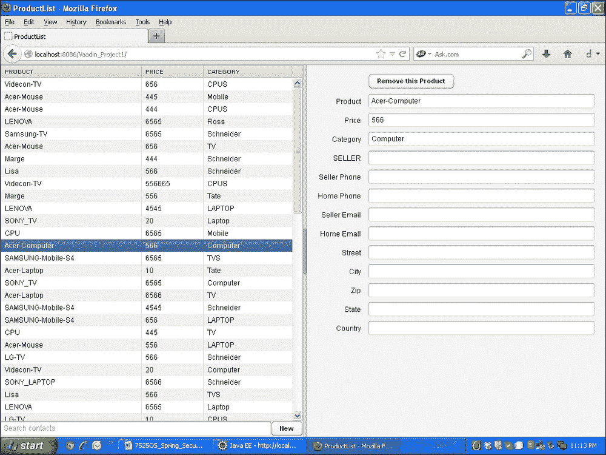
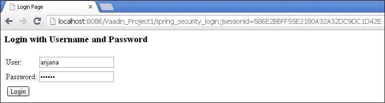
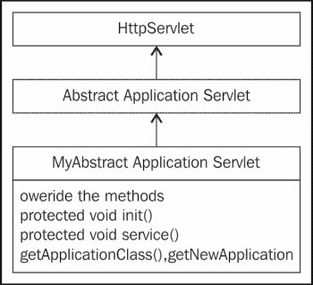
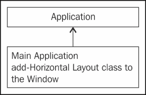
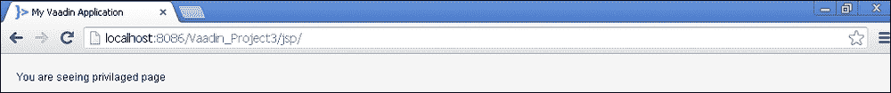
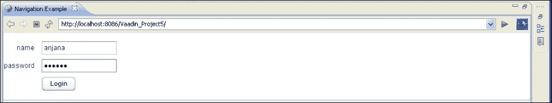

# 六、SpringSecurity 和 Vaadin

在本章中，我们将介绍：

*   使用 Vaadin 的 SpringSecurity–基本身份验证
*   使用 Vaadin 的 SpringSecurity–基于 Spring 表单的身份验证
*   Spring Security with Vaadin–定制的基于 JSP 表单的身份验证
*   使用 Vaadin 的 Spring Security–使用 Vaadin 表单

# 导言

Vaadin 已成为当前项目中流行的框架。它提供 RIA 就像 GWT 富互联网应用程序一样。它没有 RPC 调用和那些异步服务类。它的工作原理类似于 GWT 小部件。Vaadin 还可以轻松地与 Portlet 集成。在 GWT 中，我们必须安装与浏览器兼容的 GWT 插件，但在 Vaadin 中，我们不需要这样做。用 Vaadin 开发的应用程序在所有现代浏览器上都是兼容的。Vaadin 可以编写为服务器端和客户端应用程序。VaadinUI 组件实际上是一个 JavaServlet 组件，可以轻松地在 Tomcat 等 web 服务器以及 JBOSS 和 Glassfish 等应用程序服务器上运行。对于当前的演示，我使用 Tomcat 和 EclipseIndigo。

在本章中，我们将使用各种方法演示使用 Vaadin 集成的 SpringSecurity。让我们首先对此进行基本设置。这一切都是关于下载插件和创建一个示例 Vaadin 项目。

# 带 Vaadin 的 Spring Security–基本身份验证

我们的目标是对 Vaadin 应用程序进行简单的基本身份验证。我希望在访问 Vaadin 应用程序的 URL 时弹出一个登录对话框。我创建了一个简单的产品目录应用程序，它看起来非常类似于地址簿。

## 准备好了吗

*   Set up Vaadin application on Eclipse:
    *   下载Vaadin[http://vaadin.com/eclipse](http://vaadin.com/eclipse) 用于日食靛蓝。

    在这一章中，我们将演示 SpringSecurity与两个 Vaadin 版本（Vaadin 6 和 Vaadin 7）的集成。

    *   使用 vaadin7 在 Eclipse 中创建一个 vaadinweb 项目——这将生成一个带有单击按钮的默认应用程序，我们将对其进行修改。
    *   在 Tomcat 服务器上运行应用程序。
*   创建一个`applicationContext.xml`文件。必须将其命名为`applicationContext`，否则我们将在控制台中收到错误消息。
*   使用 spring 侦听器编辑`web.xml`文件。
*   在类路径中添加所有 JAR。

## 怎么做。。。

以下步骤用于将 Spring Security 与 Vaadin 集成，以演示基本身份验证：

1.  使用 spring 侦听器和 spring 筛选器更新`web.xml`文件，并使用 Vaadin servlet:

    ```java
    <display-name>Vaadin_Project1</display-name>
    <filter>
      <filter-name>springSecurityFilterChain</filter-name>
      <filter-class>org.springframework.web.filter.
        DelegatingFilterProxy</filter-class>
    </filter>

    <filter-mapping>
      <filter-name>springSecurityFilterChain</filter-name>
      <url-pattern>/*</url-pattern>
    </filter-mapping>

    <listener>
      <listener-class>
        org.springframework.web.context.ContextLoaderListener
      </listener-class>
    </listener>

      <context-param>
        <description>
        Vaadin production mode</description>
        <param-name>productionMode</param-name>
        <param-value>false</param-value>
      </context-param>

      <servlet>
        <servlet-name>Vaadin_Project1</servlet-name>
        <servlet-class>com.vaadin.server.VaadinServlet
          </servlet-class>
      <init-param>
        <description>
          Vaadin UI class to use</description>
        <param-name>UI</param-name>
        <param-value>com.example.vaadin_project1
          .Vaadin_project1UI</param-value>
      </init-param>
      <init-param>
        <description>
        Legacy mode to return the value of
           the property as a string from 
          AbstractProperty.toString()</description>
        <param-name>legacyPropertyToString</param-name>
        <param-value>false</param-value>
      </init-param>
    </servlet>
    <servlet-mapping>
      <servlet-name>Vaadin_Project1</servlet-name>
      <url-pattern>/*</url-pattern>
    </servlet-mapping>
    ```

2.  You can observe that we haven't configured `<context-param>` as we did in our previous applications. Spring will automatically look for the `applicationContext.xml` file. For setting up Vaadin we need to configure the Vaadin servlet class with two parameters `PropertyToString` and a UI class named `com.example.vaadin_project1`. Edit the `applicationContext.xml` file using the following code:

    ```java
    <http auto-config="true">
     <intercept-url pattern="/Vaadin_Project1/**"access="ROLE_EDITOR"/> 
     <intercept-url pattern="/Vaadin_Project1/*.*"access="ROLE_EDITOR"/> 
     <intercept-url pattern="/**" access="ROLE_EDITOR" />
     <http-basic /> 
    </http>

    <authentication-manager>
      <authentication-provider>
        <user-service>
          <user name="anjana" password="123456"authorities="ROLE_EDITOR" />
        </user-service>
      </authentication-provider>
    </authentication-manager>
    </beans:beans>
    ```

    这是用于基本身份验证的简单配置。使用此配置，我们希望在显示 Vaadin 应用程序之前出现一个登录对话框。我创建了一个新的角色编辑器。

这里我们创建了一个`ProductList`组件来显示产品列表。

## 它是如何工作的。。。

在这个例子中，我们演示了一种使用 Vaadin 应用程序的基本身份验证机制。有时，我们不需要为用户显示 jsp 页面或 Vaadin 登录表单，在这种情况下，我们进行基本身份验证，其中会弹出一个对话框，请求用户输入其凭据。成功后，用户可以访问 Vaadin 应用程序。应用程序的工作流程如下所示：

现在访问以下 URL：

`http://localhost:8086/Vaadin_Project1/`

您应该看到如下屏幕截图所示的页面：




## 另见

*   使用 Vaadin 的*SpringSecurity–基于 Spring 表单的身份验证*配方
*   使用 Vaadin 的*SpringSecurity–定制的基于 JSP 表单的身份验证*配方
*   使用 Vaadin 的*SpringSecurity–使用 Vaadin 表单*配方

# 使用 Vaadin 的 SpringSecurity–基于 Spring 表单的身份验证

我们将在 Vaadin 中演示基于表单的身份验证。这与我们在之前的配方中使用的身份验证非常相似。我们将编辑`applicationContext.xml`文件。我们没有创建任何定制的登录表单，我们希望使用 spring 内部登录表单。

## 准备好了吗

您必须注释`application-Context.xml`文件中的`<http-basic/>`标记。

## 怎么做。。。

编辑`applicationContext.xml`文件，如下代码所示：

```java
<http auto-config="true">
  <intercept-url pattern="/Vaadin_Project1/**"
     access="ROLE_EDITOR"/> 
  <intercept-url pattern="/Vaadin_Project1/*.*"
     access="ROLE_EDITOR"/> 
  <intercept-url pattern="/**" access="ROLE_EDITOR" />
</http>
<authentication-manager>
  <authentication-provider>
    <user-service>
       <user name="anjana" password="123456"
       authorities="ROLE_EDITOR" />
    </user-service>
  </authentication-provider>
</authentication-manager>
```

## 它是如何工作的。。。

在本例中，调用 spring 的内部登录表单来验证 Vaadin 应用程序。此配置在`applicationConext.xml`文件中完成。Spring 框架为用户弹出自己的内部 jsp 文件。当用户输入凭据并单击**提交**时，他们将被重定向到 Vaadin 应用程序。运行 Tomcat 服务器。

现在访问以下 URL：

`http://localhost:8086/Vaadin_Project1/`



这是一个内置的 Spring 登录表单。

输入登录用户名和密码，您将进入 Vaadin 产品列表。

类似地，只需编辑身份验证管理器配置，就可以使用数据库和 LDAP 进行身份验证。

## 另见

*   使用 Vaadin 的*SpringSecurity–定制的基于 JSP 表单的身份验证*配方
*   使用 Vaadin 的*SpringSecurity–使用 Vaadin 表单*配方

# 使用 Vaadin 的 SpringSecurity–定制的基于 JSP 表单的身份验证

到目前为止，我们已经演示了使用 Spring Security API 登录表单和登录弹出对话框的 Vaadin 7 应用程序。我们所做的只是在应用程序上下文文件中创建用户。

这一次，我们将为应用程序上下文提供一个不同的名称，并为其提供一个定制的登录表单，并使用 Vaadin 6 项目。

## 准备好了吗

*   创建一个示例 Vaadin 6 项目
*   在构建路径中添加与 Spring 相关的 JAR
*   添加与 SpringSecurity相关的 JAR
*   添加`vaadin-spring-security.xml`文件
*   添加`mybeans.xml`文件
*   如前一节所示编辑`web.xml`文件
*   同时在`web-inf lib`文件夹中添加与弹簧相关的罐子

## 怎么做。。。

以下步骤是使用定制 JSP 和 Vaadin 应用程序实现基于表单的身份验证。

由于 Vaadin 6 应用程序的入口点是，因此我们将创建一个扩展`AbstractApplicationServlet`的类。这将为我们提供一个覆盖类的方法的选项。

我们还将创建一个扩展`Application`类的类。在这个类中，我们将创建一个窗口。例如，我们将在登录后添加一些文本。

我们还将在`web.xml`文件中添加 jsp 文件映射。

我们需要将`MyAbstractApplicationServlet`类映射为文件`web.xml`中的 Servlet。

我们还需要配置 Spring 上下文侦听器和 Spring 过滤器。

1.  编辑`web.xml`文件：

    ```java
    <display-name>Vaadin_Project3</display-name>
      <context-param>
        <description>Vaadin production mode</description>
        <param-name>productionMode</param-name>
        <param-value>true</param-value>
      </context-param>
      <context-param>
        <param-name>contextConfigLocation</param-name>
        <param-value>
          /WEB-INF/vaadin-spring-security.xml
          /WEB-INF/mybeans.xml
        </param-value>

      </context-param>

      <servlet>
        <servlet-name>login</servlet-name>
        <jsp-file>/jsp/login.jsp</jsp-file>
      </servlet>

      <servlet>
        <servlet-name>login_error</servlet-name>
        <jsp-file>/jsp/login_error.jsp</jsp-file>
      </servlet>

      <servlet-mapping>
        <servlet-name>login</servlet-name>
        <url-pattern>/jsp/login</url-pattern>
      </servlet-mapping>

      <servlet-mapping>
        <servlet-name>login_error</servlet-name>
        <url-pattern>/jsp/login_error</url-pattern>
      </servlet-mapping>

     <servlet>
     <servlet-name>Vaadin Application Servlet</servlet-name>
     <servlet-class>packt.vaadin.MyAbstractApplicationServlet</servlet-class>
     </servlet>

      <servlet-mapping>
        <servlet-name>Vaadin Application Servlet</servlet-name>
        <url-pattern>/*</url-pattern>

      </servlet-mapping>
    ```

2.  编辑该`vaadin-spring-security.xml`文件：

    ```java
    <global-method-security pre-post-annotations="enabled" />

    <http auto-config='true'>
      <intercept-url pattern="/jsp/login*"access="IS_AUTHENTICATED_ANONYMOUSLY" />
      <intercept-url pattern="/jsp/login_error*"access="IS_AUTHENTICATED_ANONYMOUSLY" />
      <intercept-url pattern="/**" access="ROLE_USER" />
      <form-login login-page='/jsp/login'authentication-failure-url="/jsp/login_error" />
    </http>

    <authentication-manager>
      <authentication-provider>
        <user-service>
          <user name="raghu" password="anju"authorities="ROLE_USER,ROLE_ADMIN" />
          <user name="onju" password="bonju"authorities="ROLE_USER" />
        </user-service>
      </authentication-provider>
    </authentication-manager>
    ```

3.  Subclass and override the method `AbstractApplicationServlet`.

    `AbstractApplicationServlet`类是一个抽象类，它扩展了`HttpServlet`并实现了一个名为*常量*的接口。`The Service()`和`init()`方法是 servlet 容器使用的 servlet 方法。我们已经创建了一个`appContext`对象，并在`init ()`方法中对其进行了初始化。已重写`getNewApplication()`方法以获取扩展应用程序的类。`getApplication()`方法已被重写。

    

4.  The implementation is given as follows:

    `MyAbstractApplicationServlet`

    ```java
    public class MyAbstractApplicationServlet extends AbstractApplicationServlet
    {
      private WebApplicationContext appContext;
      private Class<? extends Application> applicationClass;

      @Override
      protected Application getNewApplication(HttpServletRequest httpServletRequest) throws ServletException {
          MainApplication mainApplication = (MainApplication)appContext.getBean("applicationBean");
          mainApplication.setWebApplicationContext(appContext);
          return  mainApplication;
        }

        @Override
        protected void service(HttpServletRequest request, HttpServletResponse response)throws ServletException, IOException {
          super.service(request, response); 
        }

        @Override
        public void init(ServletConfig servletConfig)throws ServletException {
          super.init(servletConfig);   
          appContext = WebApplicationContextUtils.getWebApplicationContext(servletConfig.getServletContext());
        }

        @Override
        protected Class<? extends Application>getApplicationClass() throws ClassNotFoundException {
        return MainApplication.class;
      }
    }
    ```

5.  Subclass and override the method `ApplicationClass`.

    `ApplicationClass`是一个抽象类，实现了一些接口。我们已经重写了抽象类的`init()`方法。您必须创建`HeaderHorizontalLayout`类，并将它们作为组件添加到窗口中。

    

    主要应用

    ```java
    @Component("applicationBean")
    @Scope("prototype")

    public class MainApplication extends Application {

      public WebApplicationContext webappContext;

      @Override
      public void init() {
        Window window;
        window = new Window("My Vaadin Application");
        window.addComponent(new HeaderHorizontalLayout(this));
        window.addComponent(new BodyHorizontalLayout(this));
        window.addComponent(new FooterHorizontalLayout(this));
        setMainWindow(window);
      }

      public void setWebApplicationContext(WebApplicationContext appContext){
      this.webappContext = webappContext;
      }

    }
    ```

## 它是如何工作的。。。

在本例中，我们使用定制的 jsp 页面来处理对 Vaadin 应用程序的访问。当用户试图访问 Vaadin 应用程序时，会向用户显示定制的 jsp。用户输入用户名和密码，然后由 Spring 框架进行身份验证。验证成功后，将显示 Vaadin 页面。

工作流程如下所示：

现在访问 URL:

`http://localhost:8086/Vaadin_Project3/`


输入登录用户名和密码，您将进入 Vaadin 页面。



## 另见

*   使用 Vaadin 的*SpringSecurity–使用 Vaadin 表单*配方

# 使用 Vaadin 的SpringSecurity–使用 Vaadin 表格

到目前为止我们已经使用了定制的 JSP 页面或 Spring 提供的登录弹出框或 JSP 文件。我们还演示了与 Vaadin 6 和 Vaadin 7 的SpringSecurity集成。因此，我试图提供一个完整的带有 SpringSecurity实现的 Vaadin。让我们创建一个 Vaadin 表单，并将其与 Spring Security 集成。

## 准备好了吗

*   在 EclipseIDE 中创建一个 Vaadin7 项目
*   创建一个扩展面板的`MyLoginView`类
*   创建一个扩展面板的`SecuredView`类
*   创建扩展`VaadinServlet`的`MyVaadinServlet`类
*   创建一个`VaadinRequestHolder`类
*   配置`web.xml`文件
*   编辑`applicationContext.xml`文件
*   实现面板类的`View`接口

## 怎么做。。。

下面给出的步骤用于创建 Vaadin 登录表单，并使用它使用 Spring Security 对用户进行身份验证：

1.  `MyLoginView` for the login form will be loaded on application start up.

    ```java
    public class MyLoginView extends Panel implements View {
      private Layout mainLayout;
      Navigator navigator;
      protected static final String CountView = "SecuredView";
      public MyLoginView() {
        final FormLayout loginlayout=new FormLayout();
        final TextField nameField=new TextField("name");
        final PasswordField passwordField=new PasswordField("password");
        loginlayout.addComponent(nameField);
        loginlayout.addComponent(passwordField);
        Button loginButton = new Button("Login");
        loginlayout.addComponent(loginButton);
        mainLayout = new VerticalLayout();
        mainLayout.addComponent(loginlayout);
        setContent(mainLayout);

        loginButton.addClickListener(new Button.ClickListener() {
          public void buttonClick(ClickEvent event) {
            try{
              ServletContext servletContext = VaadinRequestHolder.getRequest().getSession().getServletContext();
              UsernamePasswordAuthenticationToken token = new UsernamePasswordAuthenticationToken(nameField.getValue(),passwordField.getValue());
                token.setDetails( new WebAuthenticationDetails(VaadinRequestHolder.getRequest()));
                WebApplicationContext wac = WebApplicationContextUtils.getRequiredWebApplicationContext(servletContext);
                AuthenticationManager authManager = wac.getBean(AuthenticationManager.class);
                Authentication authentication = authManager.authenticate(token);
                SecurityContextHolder.getContext().setAuthentication(authentication);
                if(authentication.isAuthenticated()){
                  Notification.show("You are authenticated");
                navigator = new Navigator(getUI().getCurrent(), mainLayout);
                navigator.addView(CountView, new SecuredView());
                navigator.navigateTo(CountView);
              }

        } catch (BadCredentialsException e) {

          Notification.show("Bad credentials");
        }
      }
    });

    }
    @Override
    public void enter(ViewChangeEvent event) {
    }
    ```

    我们使用了表单布局，并添加了用户名和密码字段。我们增加了一个按钮。单击一个按钮，我们正在进行身份验证。

    我们正在捕获`requestHolder.UserNamePasswords`中的对象。身份验证令牌从用户名和密码字段接收输入。然后将令牌传递给`AuthenticationManger`以验证字段。如果身份验证成功，它将导航到安全页面。它还将向用户发出通知。

2.  `Secured View` is to be used after authentication and to provide logout functionality.

    ```java
    public class SecuredView extends Panel implements View {
      public static final String NAME = "count";
      private Layout mainLayout;
      Navigator navigator;
      protected static final String MainView = "LoginView";
      public SecuredView() {
        mainLayout = new VerticalLayout();
        mainLayout.addComponent(new Label("You are seeing a secured page"));
        Button logoutButton = new Button("Logout");
        mainLayout.addComponent(logoutButton);
        setContent(mainLayout);
        logoutButton.addClickListener(new Button.ClickListener() {
        public void buttonClick(ClickEvent event) {
        try{
          ServletContext servletContext = VaadinRequestHolder.getRequest().getSession().getServletContext();
          WebApplicationContext wac = WebApplicationContextUtils.getRequiredWebApplicationContext(servletContext);
          LogoutHandler logoutHandler = wac.getBean(LogoutHandler.class);
          Authentication authentication = SecurityContextHolder.getContext().getAuthentication();
          logoutHandler.logout(VaadinRequestHolder.getRequest(), null, authentication);

     Notification.show("You are logged out");
     navigator = new Navigator(getUI().getCurrent(), mainLayout);
     navigator.addView(MainView, new MyLoginView());
     navigator.navigateTo(MainView);
        } catch (BadCredentialsException e) {

        Notification.show("Bad credentials");
        }
      }
    });
    }

    public void enter(ViewChangeEvent event) {

    }

    }
    ```

    安全视图有一个标签和一个注销按钮。注销按钮点击事件处理`springlogout`。注销时，用户将被重新定向到登录页面。`LogoutHandler`类有一个`logout ()`方法来处理身份验证。我使用了 navigator 类。您可以使用提供 UI 对象的 UI 类`getUI.Current`创建 navigator 实例。

    这种方法可以在面板类中使用。我还将布局对象传递给了构造函数。

    ```java
    navigator = new Navigator(getUI().getCurrent(),mainLayout);
    navigator.addView(MainView, new MyLoginView());
    navigator.navigateTo(MainView);
    ```

    这两个类别的图示如下所示：

    

3.  Extend the Vaadin servlet to capture the request object.

    `MyVaadinServlet`

    ```java
    public class MyVaadinServlet extends VaadinServlet {
      @Override
      protected void service(HttpServletRequest request,HttpServletResponse response) throws ServletException,IOException {
      SecurityContextHolder.setContext(SecurityContextHolder.createEmptyContext());
      VaadinRequestHolder.setRequest(request);
      super.service(request, response);
      VaadinRequestHolder.clean();
      SecurityContextHolder.clearContext();
      }
    }
    ```

    Vaadin servlet 在`web.xml`文件中配置。它接受 UI 类作为参数。在前面的代码中，我们扩展了 Vaadin servlet 并重写了`service ()`方法，在该方法中，我们将请求传递给`VaadinRequestHolder`类。通过这样做，我们将把上下文对象传递给`SecurityContextHolder`以开始身份验证。

    

4.  Register the views in the UI class.

    `Vaadin_project5UI`

    ```java
    @SuppressWarnings("serial")
    @Theme("vaadin_project5")
    public class Vaadin_project5UI extends UI{
      private Layout mainLayout;
      Navigator navigator;
      protected static final String CountView = "main";
      @Override
      protected void init(VaadinRequest request) {
        getPage().setTitle("Navigation Example");
        // Create a navigator to control the views
        navigator = new Navigator(this, this);
        // Create and register the views
        navigator.addView("", new MyLoginView());
        navigator.addView(CountView, new SecuredView());
      }
    }
    ```

    在这段代码中，我们正在注册`LoginView`和`SecuredView`，并将调用默认的登录视图。

5.  Configuring the `web.xml` file:

    ```java
    <display-name>Vaadin_Project5</display-name>
    <context-param>
      <description>
      Vaadin production mode</description>
      <param-name>productionMode</param-name>
      <param-value>false</param-value>
    </context-param>
    <servlet>
     <servlet-name>Vaadin_project5 Application</servlet-name>
     <servlet-class>com.example.vaadin_project5.MyVaadinServlet</servlet-class>
     <init-param>
     <description>
     Vaadin UI class to use</description>
     <param-name>UI</param-name>
     <param-value>com.example.vaadin_project5.Vaadin_project5UI</param-value>
     </init-param>
     <init-param>
     <description>
     Legacy mode to return the value of the propertyas a string from AbstractProperty.toString()</description>
     <param-name>legacyPropertyToString</param-name>
     <param-value>false</param-value>
     </init-param>
    </servlet>
    <servlet-mapping>
     <servlet-name>Vaadin_project5 Application</servlet-name>
     <url-pattern>/*</url-pattern>
    </servlet-mapping>
    <listener>
     <listener-class>org.springframework.web.context.ContextLoaderListener</listener-class>
    </listener>
    </web-app>
    ```

    我们已经在`web.xml`中配置了`MyVaadinServlet`。

6.  编辑该`application-Context.xml`文件。

    ```java
    <global-method-security pre-post-annotations="enabled" />
    <authentication-manager>
      <authentication-provider>
        <user-service>
        <user name="anjana" password="123456"authorities="ROLE_EDITOR" />
        </user-service>
      </authentication-provider>
    </authentication-manager>
    <beans:bean class="org.springframework.security.web.authentication.logout.SecurityContextLogoutHandler">
      <beans:property name="invalidateHttpSession"value="false" />
    </beans:bean>
    </beans:beans>
    ```

## 它是如何工作的。。。

在这个例子中，我们创建了一个 Vaadin 登录表单。如果开发人员不想使用外部 jsp，这是使用 Vaadin 框架类创建登录表单的另一个选项。这将使其成为纯 Vaadin 应用程序和 SpringSecurity应用程序。在显示实际的产品目录页面之前，用户由 Spring Security 进行身份验证和授权。Vaadin 表单将用户的凭证提交给执行身份验证和授权的 SpringSecurity框架。`MyVaadinServlet`类与 SpringSecurity上下文通信，以设置与 Vaadin 应用程序的安全上下文。

Spring Security 与 Vaadin 的工作流程如下所示：

*   运行 Tomcat 服务器。
*   Now access the URL:

    `http://localhost:8086/Vaadin_Project5/`

以下屏幕截图显示了 Vaadin 登录表单：



它还显示错误凭据的消息：


认证后，您将被导航到安全页面：


点击**注销**上的按钮，您将被带回登录视图。以下屏幕截图显示了相关信息：

