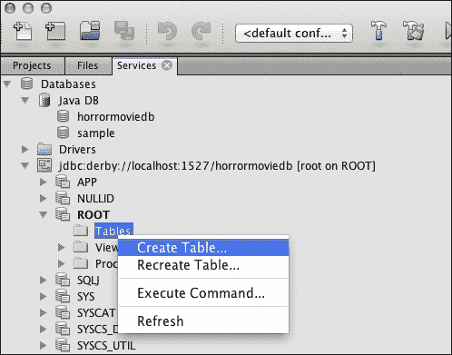
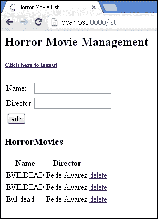
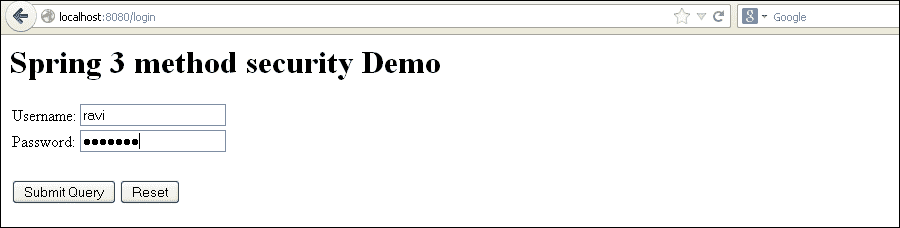

# 八、SpringSecurity 和 ORM 和 NoSQL DB

在本章中，我们将介绍：

*   使用@preAuthorize 注释的 Hibernate SpringSecurity
*   使用带有@preAuthorize 注释的身份验证提供程序的 Hibernate SpringSecurity
*   SpringSecurity与 Hibernate 结合使用 Derby 数据库的用户详细信息服务
*   使用 MongoDB 的 SpringSecurity

# 导言

Spring 框架被设计成与类似于 Mybatis、Hibernate 等的 ORM 框架轻松集成。Hibernate 教程有很好的文档记录，可以在 JBoss 网站上找到。Hibernate 为我们提供了数据持久性。

在本章中，我们将看到如何将 SpringSecurity与 ORM 框架集成。我们还将 Spring Security 与最新的 MongoDB 集成。

我们将首先使用 Hibernate 和 Spring 进行一些基本设置。由于本章有数据库相关的内容，我们需要为本章中使用的所有配方创建一个数据库。我将 NetBeans IDE 与 maven 一起使用。我觉得 NetBeans IDE 与其他产品相比非常先进。

## 设置 Spring Hibernate 应用程序

我们将创建一个简单的恐怖电影应用程序，该应用程序将在 UI 中显示包含一些**CRUD**（**创建、读取、更新和删除**功能的恐怖电影列表。设置*Spring Hibernate*应用程序涉及以下步骤：

1.  在 Derby 中创建一个`horrormoviedb`数据库。您可以使用 NetBeans。
2.  点击**服务**选项卡，您将看到**数据库**。
3.  Right click to **JavaDB** to see the **Create Database...** option. Select the **Create Database...** option.

    

4.  Create a table in the database `horrormovie`.

    

5.  在表中创建列，并将这些列命名为`horrormovie_id`、`horrormovie_name`和`horrormovie_director`。
6.  创建一个 maven 项目，用 Spring、Hibernate、Derby 和 SpringSecurity依赖项更新 POM，并在 NetBeans IDE 中打开它。
7.  使用`@table`和`@column`注释创建实体类。
8.  创建一个`DAO`和`DAOImpl`类来处理 hibernate 操作。
9.  创建一个`Service`和`ServiceImpl`类，使其行为类似于`DAO`和 UI 之间的中间管理器。
10.  创建一个控制器来处理 UI 部件。

# 使用@preAuthorize 注释的带 Hibernate 的 SpringSecurity

在当前演示中，我们使用两个不同的数据库。身份验证管理器配置有`tenant1DataSource`，连接到保存用户和角色信息的 Derby 数据库。使用此数据源，我们将进行身份验证和授权。

为了显示`horrormovie`列表，我们在 Derby 中创建了另一个与 Hibernate 配置文件一起使用的数据源。

在`DAOImpl`类方法中，我们使用`@preAuthorize`注释。

让我们使用 GlassFish 应用程序服务器来运行该应用程序。

## 准备好了吗

*   编辑`application-security.xml`。
*   编辑`horrormovie-servlet.xml`。
*   使用`DAOImpl`中的`@preAuthorize`注释。Spring Security 在调用方法时授权用户。

## 怎么做。。。

以下步骤将对 Hibernate 应用程序执行身份验证和授权：

1.  使用数据源详细信息和 Bean 信息编辑`application-security.xml`文件。

    ```java
    <global-method-security pre-post-annotations="enabled" />

      <http auto-config="false"  use-expressions="true">
        <intercept-url pattern="/login" access="permitAll" />
        <intercept-url pattern="/logout" access="permitAll" />
        <intercept-url pattern="/accessdenied" access="permitAll" />
        <intercept-url pattern="/**"access="hasRole('ROLE_EDITOR')" />
        <form-login login-page="/login" default-target-url="/list" authentication-failure-url="/accessdenied" />
        <logout logout-success-url="/logout" />
      </http>

      <authentication-manager alias="authenticationManager">
        <authentication-provider>
          <jdbc-user-service data-source-ref="tenant1DataSource"
            users-by-username-query=" select username,password ,'true' as enabled from users where username=?"  
            authorities-by-username-query=" 
            select u.username as username, ur.authority as authority from users u, user_roles ur  
            where u.user_id = ur.user_id and u.username =?"
            /> 
        </authentication-provider>
      </authentication-manager>

      <beans:bean id="horrorMovieDAO" class="com.packt.springsecurity.dao.HorrorMovieDaoImpl" />
      <beans:bean id="horrorMovieManager" class="com.packt.springsecurity.service.HorrorMovieManagerImpl" />
      <beans:bean id="tenant1DataSource" class="org.springframework.jdbc.datasource.DriverManagerDataSource">
      <beans:property name="driverClassName" value="org.apache.derby.jdbc.EmbeddedDriver" />
      <beans:property name="url" value="jdbc:derby://localhost:1527/client1" />
      <beans:property name="username" value="client1" />
      <beans:property name="password" value="client1" />

    </beans:bean>
    ```

2.  Edit the `horrormovie-servlet.xml` file with the controller information.

    ```java
    <global-method-security pre-post-annotations="enabled" />

      <http auto-config="true">
        <intercept-url pattern="/spring-security-wicket/**" access="ROLE_SELLER"/>
        <intercept-url pattern="/spring-security-wicket/*.*" access="ROLE_SELLER"/> 
        <intercept-url pattern="/**" access="ROLE_SELLER" />
      <http-basic />
    </http>
    <authentication-manager> 
      <authentication-provider> 
        <jdbc-user-service data-source-ref="MySqlDS" 
          users-by-username-query=" 
          select username,password, enabled   
          from users1 where username=?"  
          authorities-by-username-query=" 
          select u.username, ur.role from users1 u, user_roles ur  
          where u.user_id = ur.user_id and u.username =?  " /> 
      </authentication-provider>
    </authentication-manager>
    ```

    它使用 JDBC 进行身份验证服务。

3.  当您执行`addHorrorMovie`方法时使用注释 Spring 检查安全上下文对象的凭证，并进行身份验证和授权；这在以下代码中给出：

    ```java
    @Repository
    public class HorrorMovieDaoImpl implements HorrorMovieDAO  {

      @Autowired
      private SessionFactory sessionFactory;

      @PreAuthorize("hasRole('ROLE_AUTHOR')")
      @Override
      public void addHorrorMovie(HorrorMovieEntity horrormovie) {
        this.sessionFactory.getCurrentSession().save(horrormovie);
      }

      @SuppressWarnings("unchecked")
      @Override
      public List<HorrorMovieEntity> getAllHorrorMovies() {
        return this.sessionFactory.getCurrentSession().createQuery("from HORRORMOVIE").list();
      }

      @Override
      public void deleteHorrorMovie(Integer horrorMovieId) {
        HorrorMovieEntity horrorMovie = (HorrorMovieEntity)sessionFactory.getCurrentSession().load(HorrorMovieEntity.class, horrorMovieId);
        if (null != horrorMovie) {
          this.sessionFactory.getCurrentSession().delete(horrorMovie);
        }
      }
    }
    ```

4.  下面给出了一些 SQL 命令：

    ```java
    create table HORRORMOVIE
     (HORRORMOVIE_ID int generated by default as identity 
     (START WITH 2, INCREMENT BY 1),
     HORRORMOVIE_NAME char(50),HORRORMOVIE_DIRECTOR char(50));

    insert into HORRORMOVIE values 
     (1, 'EVILDEAD','Fede Alvarez');
    insert into HORRORMOVIE values 
     (DEFAULT, 'EVILDEAD2','Fede Alvarez');

    ```

## 它是如何工作的。。。

在本例中，我们创建了一个 Hibernate 应用程序，并使用 JDBC 服务进行身份验证。Spring 框架中断访问应用程序的请求，并请求用户输入凭据。使用`application-security.xml`文件中提供的 JDBC 详细信息对凭证进行身份验证。

成功后，用户将重定向到显示电影列表的应用程序。

现在访问以下 URL：

`http://localhost:8080/login`

使用 JDBC 服务进行身份验证和授权以及对使用 annotation on 方法应用 Spring Security 的屏幕截图如下：

示例的工作流如以下屏幕截图所示：




## 另见

*   使用身份验证提供程序使用 Hibernate 的*SpringSecurity*配方
*   使用用户详细信息服务和 Derby 数据库的 Hibernate 的*SpringSecurity*配方
*   MongoDB 配方的*SpringSecurity*

# 使用带有@preAuthorize 注释的身份验证提供程序的 Hibernate SpringSecurity

我们正在使用示例`horrormovie`应用程序演示 SpringSecurity，Hibernate 使用自定义身份验证提供程序和`@preAuthorize`注释。

在此配方中，我们将创建自己的自定义身份验证提供程序并实现接口身份验证提供程序。我们将在`controller`方法上应用注释，而不是`hibernate`方法上的。

## 准备好了吗

*   创建一个实现`AuthenticationProvider`接口的新类，并将 Bean 定义添加到`application-security.xml`文件中
*   编辑`application-security.xml`文件
*   在控制器中使用`@preAuthorize`注释

## 怎么做。。。

使用`AuthenticationProvider`接口实现 SpringSecurity的步骤如下：

1.  使用数据源详细信息和 Bean 信息编辑`application-security.xml`文件。

    ```java
    <global-method-security pre-post-annotations="enabled" />

    <http auto-config="false"  use-expressions="true">
      <intercept-url pattern="/login" access="permitAll" />
      <intercept-url pattern="/logout" access="permitAll" />
      <intercept-url pattern="/accessdenied" access="permitAll"/>
      <intercept-url pattern="/list" access="hasRole('ROLE_EDITOR')" />
      <intercept-url pattern="/add" access="hasRole('ROLE_EDITOR')" />
      <form-login login-page="/login" default-target-url="/list" authentication-failure-url="/accessdenied" />
      <logout logout-success-url="/logout" />
    </http>

      <authentication-manager alias="authenticationManager">
     <authentication-provider ref="MyCustomAuthenticationProvider" />
     </authentication-manager>

      <beans:bean id="horrorMovieDAO" class="com.packt.springsecurity.dao.HorrorMovieDaoImpl" />
      <beans:bean id="horrorMovieManager" class="com.packt.springsecurity.service.HorrorMovieManagerImpl"/>

     <beans:bean id="MyCustomAuthenticationProvider" class="com.packt.springsecurity.controller" />
    </beans:beans>
    ```

2.  编辑的`MyCustomAuthenticationProvider`文件。

    ```java
    public class MyCustomAuthenticationProvider implements AuthenticationProvider {
      @Override
      public boolean supports(Class<? extends Object>authentication)
    {
        return (UsernamePasswordAuthenticationToken.class.isAssignableFrom(authentication));
        }

     private static Map<String, String> APP_USERS= new HashMap<String, String>(2);
     private static List<GrantedAuthority> APP_ROLES= new ArrayList<GrantedAuthority>();
     static
     {
     APP_USERS.put("ravi", "ravi123");
     APP_USERS.put("chitra", "chitra123");
     APP_ROLES.add(new SimpleGrantedAuthority("ROLE_EDITOR"));
     }

      @Override
      public Authentication authenticate(Authentication auth)
      {
     if (APP_USERS.containsKey(auth.getPrincipal())
     && APP_ROLES.get(auth.getPrincipal()).equals(auth.getCredentials()))
     {
     return new UsernamePasswordAuthenticationToken(auth.getName(), auth.getCredentials(),
     AUTHORITIES);
     }
     throw new BadCredentialsException("Username/Password does not match for "
          + auth.getPrincipal());
        }
      }
    }
    ```

3.  使用控制器中的注释。

    ```java
    AddHorrorMovieController
    @PreAuthorize("hasRole('ROLE_EDITOR')")
    @RequestMapping(value = "/add", method = RequestMethod.POST)
    public String addHorrorMovie(
      @ModelAttribute(value = "horrorMovie") HorrorMovieEntity horrorMovie,
        BindingResult result) {
        horrorMovieManager.addHorrorMovie(horrorMovie);
        return "redirect:/list";
      }
    ```

## 它是如何工作的。。。

现在访问以下 URL：

`http://localhost:8080/login`

在中断请求后，Spring Security 调用`MyCustomAuthenticationProvider`，其中包含用于身份验证的重写身份验证方法以及用户信息。用户凭据通过`APP_Users`映射中的凭据进行身份验证和授权。成功的身份验证和授权后，用户将被重定向到`spring-security.xml`文件中配置的成功 URL。

使用自定义身份验证提供程序进行身份验证和授权以及在控制器中的方法上使用 annotation on 应用 Spring Security 的屏幕截图如下：


## 另见

*   使用@preAuthorize 注解配方的带 Hibernate 的*SpringSecurity*
*   使用带有@preAuthorize 注释的自定义身份验证提供程序的 Hibernate 的*SpringSecurity*配方
*   使用用户详细信息服务和 Derby 数据库的 Hibernate 的*SpringSecurity*配方
*   MongoDB 配方的*SpringSecurity*

# 使用 UserDetailsService 和 Derby 数据库实现 Hibernate 的 SpringSecurity

到目前为止，我们已经看到了 Hibernate 和 Spring 与各种身份验证提供商的安全性。在本节中，我们将使用 Hibernate 从数据库中检索用户和权限。

为此，我们将实现`UserDetailsService`接口，并在接口中实现一个方法。首先，我们需要为用户和角色创建实体类。

我们还将`@preAuthorize`注释移动到`controller`类。

## 准备好了吗

*   创建一个实现`UserDetailsService`接口的新类，并将 Bean 定义添加到`application-security.xml`文件中
*   编辑`application-security.xml`文件
*   在控制器中使用`@preAuthorize`注释
*   在恐怖数据库中添加表`USERS`和`USER_ROLE`
*   插入角色`ROLE_EDITOR`和名为`ravi`和`ravi123`的用户

## 怎么做。。。

通过实现与 Hibernate 方法交互的`UserDetailsService`接口，使用以下步骤将 Spring Security authentication 与 Hibernate 集成：

1.  创建一个实现`UserDetailsService`接口的类`MyUserDetailsService`。

    ```java
    public class MyUserDetails implements UserDetailsService {
      @Autowired
      private UsersDAO UsersDAO;
      public UserDetails loadUserByUsername(String userName)
      throws UsernameNotFoundException {

        Users users= UsersDAO.findByUserName(userName);
        boolean enabled = true;
        boolean accountNonExpired = true;
        boolean credentialsNonExpired = true;
        boolean accountNonLocked = true;
        return new User(
          users.getUserName(), 
          users.getUserPassword(), 
          enabled, 
          accountNonExpired, 
          credentialsNonExpired, 
          accountNonLocked,
          getAuthorities(users.getRole().getRoleId().intValue()));
        }

        public Collection<? extends GrantedAuthority>getAuthorities(Integer role) {
        List<GrantedAuthority> authList = getGrantedAuthorities(getRoles(role));
        System.out.println("authList----------->"+authList);
        return authList;
      }

      public List<String> getRoles(Integer role) {

        List<String> roles = new ArrayList<String>();

        if (role.intValue() == 1) {
          roles.add("ROLE_EDITOR");
        } else if (role.intValue() == 2) {
          roles.add("ROLE_AUTHOR");
        }
        return roles;
      }

      public static List<GrantedAuthority> getGrantedAuthorities(List<String> roles) {
      List<GrantedAuthority> authorities = new ArrayList<GrantedAuthority>();
      for (String role : roles) {
        System.out.println("role----------->"+role);
        authorities.add(new SimpleGrantedAuthority(role));
      }
      return authorities;
      }

    }
    ```

2.  编辑的`application-security.xml`文件。

    ```java
    <authentication-manager alias="authenticationManager">
      <authentication-provider user-service-ref="MyUserDetails">
        <password-encoder hash="plaintext" />
      </authentication-provider>
    </authentication-manager>

    <beans:bean id="horrorMovieDAO" class="com.packt.springsecurity.dao.HorrorMovieDaoImpl" />
    <beans:bean id="horrorMovieManager" class="com.packt.springsecurity.service.HorrorMovieManagerImpl" />
    <beans:bean id="UsersDAO" class="com.packt.springsecurity.dao.UsersDAOImpl" />
    <beans:bean id="UsersManager" class="com.packt.springsecurity.service.UsersManagerImpl" />
    <beans:bean id="UserRoleDAO" class="com.packt.springsecurity.dao.UserRoleDAOImpl" />
    <beans:bean id="UserRoleManager" class="com.packt.springsecurity.service.UserRoleManagerImpl" />

    <beans:bean id="MyUserDetails" class="com.packt.springsecurity.service.MyUserDetails" />
    </beans:beans>
    ```

3.  在控制器中使用注释。

    ```java
    @PreAuthorize("hasRole('ROLE_EDITOR')")
    @RequestMapping(value = "/add", method = RequestMethod.POST)
    public String addHorrorMovie(
      @ModelAttribute(value = "horrorMovie")HorrorMovieEntity horrorMovie,
      BindingResult result) {
        horrorMovieManager.addHorrorMovie(horrorMovie);
        return "redirect:/list";
      }
    ```

## 它是如何工作的。。。

现在访问以下 URL：

`http://localhost:8080/login`

首先，我们使用`UserDetailsService`和 Hibernate 进行身份验证和授权。`UserDetailsService`是一个 SpringSecurity接口，由`MyUserDetailsService`类实现。该类在`application-security.xml`文件中配置，以便 Spring Security 调用该实现类以使用 Hibernate 加载用户详细信息。`UsersDAO.findByUserName(userName)`是根据传递的用户名调用 Hibernate 获取用户信息的方法。

在使用注释将 Spring Security 应用于控制器之后，我们应该能够使用用户名和密码（ravi 和 ravi123）登录。`<password-encoder hash="plaintext" />`是 Spring Security 支持的哈希算法。成功验证后，用户将被重定向到授权页面。

应用程序的工作流程如以下屏幕截图所示：




## 另见

*   使用@preAuthorize 注解配方的带 Hibernate 的*SpringSecurity*
*   使用带有@preAuthorize 注释的自定义身份验证提供程序的 Hibernate 的*SpringSecurity*配方
*   使用用户详细信息服务和 Derby 数据库的 Hibernate 的*SpringSecurity*配方
*   MongoDB 配方的*SpringSecurity*

# 与 MongoDB 的 Spring Security

在部分中，让我们看看 Spring Security 如何与 MongoDB 合作。MongoDB 是一种流行的 NOSQL 数据库。它是一个基于文档的数据库。MunGDB 是在流行的 C++数据库中编写的，它使它成为面向对象的基于文档的数据库。在 MongoDB 中，查询也是基于文档的，它还提供使用 JSON 样式的索引来存储和检索数据。可用的最新 Spring 版本为版本 3.2，已包含在 POC 中。

## 准备好了吗

*   下载 MongoDB 数据库
*   配置数据文件夹
*   在命令提示符下启动 MongoDB
*   在另一个命令提示符下启动 MongoDB
*   通过插入数据创建`horrordb`数据库
*   执行命令`use horrordb`
*   将 MongoDB 依赖项添加到**POM**（**项目对象模型**文件中
*   将 JSON 依赖项添加到 POM 文件
*   将 Spring 版本升级到 3.2.0，将 Spring Security 升级到 1.4
*   创建一个`MongoUserDetails`类
*   编辑`horror-movie`servlet
*   编辑`Application-security.xml`文件

## 怎么做。。。

以下步骤通过实现`UserDetailsService`接口，使用带 Spring Security 的 Mongo 对用户进行身份验证和授权：

1.  命令提示符下的数据库操作如下：

    ```java
    db.horrormovie.insert({horrormovie_id:1,horrormovie_name:
     "omen",horrormovie_director:"Richard Donner"})

    db.horrormovie.insert({horrormovie_id:2,horrormovie_name:
     "the conjuring",horrormovie_director:"James Wan"})

    db.horrormovie.insert({horrormovie_id:3,horrormovie_name:
     "The Lords of Salem",horrormovie_director:"Rob Zombie"})

    db.horrormovie.insert({horrormovie_id:4,horrormovie_name:
     "Evil Dead",horrormovie_director: "Fede Alvarez"})

    db.users.insert({id:1,username:"anjana",password:
     "123456",role:1})

    db.users.insert({id:2,username:"raghu",password:
     "123456",role:2})

    db.users.insert({id:3,username:"shami",password:
     "123456",role:3})

    ```

2.  创建一个类`MongoUserDetailsService`，该类实现`UserDetailsService`接口。

    ```java
    @Service
    public class MongoUserDetailsService implements UserDetailsService {

      @Autowired
      private UserManager userManager;
      private static final Logger logger = Logger.getLogger(MongoUserDetailsService.class);
      private org.springframework.security.core.userdetails.User userdetails;
      public UserDetails loadUserByUsername(String username)
      throws UsernameNotFoundException {
        boolean enabled = true;
        boolean accountNonExpired = true;
        boolean credentialsNonExpired = true;
        boolean accountNonLocked = true;
        Users users = getUserDetail(username);
        System.out.println(username);
        System.out.println(users.getPassword());
        System.out.println(users.getUsername());
        System.out.println(users.getRole());

        return new User(users.getUsername(), users.getPassword(),enabled,accountNonExpired,credentialsNonExpired,accountNonLocked,getAuthorities(users.getRole()));
      }

      public List<GrantedAuthority> getAuthorities(Integer role) {
        List<GrantedAuthority> authList = new ArrayList<GrantedAuthority>();
          if (role.intValue() == 1) {
            authList.add(new SimpleGrantedAuthority("ROLE_EDITOR"));

          } else if (role.intValue() == 2) {
            authList.add(new SimpleGrantedAuthority("ROLE_AUTHOR"));
        }
        return authList;
      }

      public Users getUserDetail(String username) {
      Users users = userManager.findByUserName(username);
      System.out.println(users.toString());
      return users;
    }
    ```

3.  编辑中的`application-security.xml`。

    ```java
    <global-method-security pre-post-annotations="enabled" />

    <http auto-config="false"  use-expressions="true">
      <intercept-url pattern="/login" access="permitAll" />
      <intercept-url pattern="/logout" access="permitAll" />
      <intercept-url pattern="/accessdenied" access="permitAll" />
      <intercept-url pattern="/list" access="hasRole('ROLE_EDITOR')" />
    <!--                <http-basic/>-->
      <form-login login-page="/login" default-target-url="/list" authentication-failure-url="/accessdenied" />
      <logout logout-success-url="/logout" />
    </http>

    <authentication-manager alias="authenticationManager">
    <authentication-provider user-service-ref="mongoUserDetailsService">
    <password-encoder hash="plaintext" />
    </authentication-provider>
    </authentication-manager>
    ```

4.  编辑`horrormovie-servlet.xml`。

    ```java
    <context:annotation-config />
    <context:component-scan base-package="com.packt.springsecurity.mongodb.controller" />
    <context:component-scan base-package="com.packt.springsecurity.mongodb.manager" />
    <context:component-scan base-package="com.packt.springsecurity.mongodb.dao" />
    <context:component-scan base-package="com.packt.springsecurity.mongodb.documententity" />

    <bean id="jspViewResolver"
      class="org.springframework.web.servlet.view.InternalResourceViewResolver">
      <property name="viewClass"
      value="org.springframework.web.servlet.view.JstlView" />
      <property name="prefix" value="/WEB-INF/view/" />
      <property name="suffix" value=".jsp" />
    </bean>
    <mongo:mongo host="127.0.0.1" port="27017" />
    <mongo:db-factory dbname="horrordb" />

    <bean id="mongoTemplate" class="org.springframework.data.mongodb.core.MongoTemplate">
    <constructor-arg name="mongoDbFactory" ref="mongoDbFactory" />
    </bean>

    <bean id="horrorMovieDAO" class="com.packt.springsecurity.mongodb.dao.HorrorMovieDaoImpl" />
    <bean id="horrorMovieManager" class="com.packt.springsecurity.mongodb.manager.HorrorMovieManagerImpl" />
    <bean id="UsersDAO" class="com.packt.springsecurity.mongodb.dao.UsersDAOImpl" />
    <bean id="userManager" class="com.packt.springsecurity.mongodb.manager.UserManagerImpl" />
    <bean id="mongoUserDetailsService" class="com.packt.springsecurity.mongodb.controller.MongoUserDetailsService" />

    <bean id="HorroMovieController" class="com.packt.springsecurity.mongodb.controller.HorrorMovieController" />
    ```

5.  使用控制器中的注释。

    ```java
    @PreAuthorize("hasRole('ROLE_EDITOR')")
    @RequestMapping(value = "/add", method = RequestMethod.POST)
    public String addHorrorMovie(
    @ModelAttribute(value = "horrorMovie")HorrorMovieEntity horrorMovie,
      BindingResult result) {
      horrorMovieManager.addHorrorMovie(horrorMovie);
      return "redirect:/list";
    }
    ```

## 它是如何工作的。。。

首先，我们使用`MongoDetailsService`和 Spring 数据进行身份验证和授权。`MongoDetailsService`是`UserDetailsService`的实现，`getUserDetail`（字符串用户名）根据传递的用户名调用`springdata`类从 Mongo 数据库获取用户凭证。如果数据基于用户名显示，则表示身份验证成功。然后，我们使用注释在控制器方法上应用 SpringSecurity。

现在我们应该能够使用用户名和密码（ravi 和 123456）登录。

现在访问以下 URL：

`http://localhost:8080/login`

以下屏幕截图演示了工作流：


## 另见

*   使用@preAuthorize 注解配方的带 Hibernate 的*SpringSecurity*
*   使用带有@preAuthorize 注释的自定义身份验证提供程序的 Hibernate 的*SpringSecurity*配方
*   使用用户详细信息服务和 Derby 数据库的 Hibernate 的*SpringSecurity*配方
*   MongoDB 配方的*SpringSecurity*