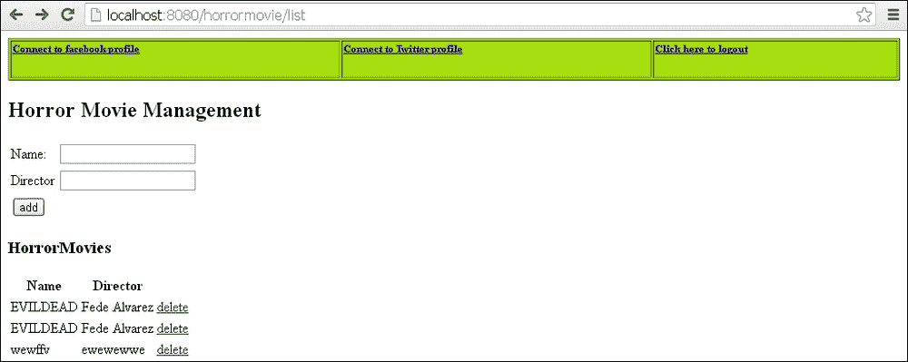
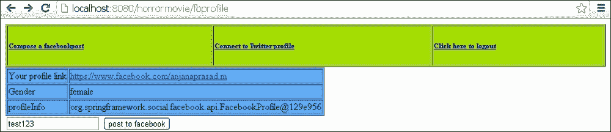
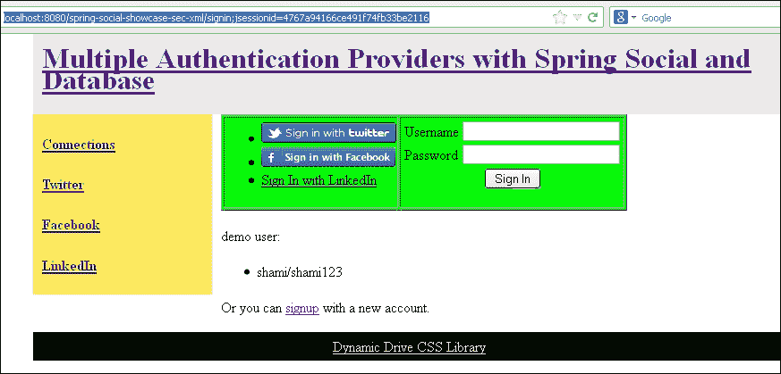
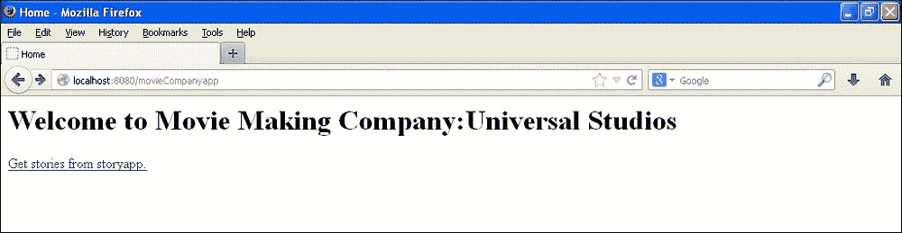
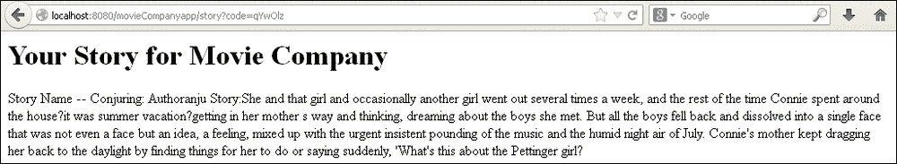

# 第九章，春安春联

在本章中，我们将介绍：

*   Spring Security 与 Spring Social 一起访问 Facebook
*   Spring Security 与 Spring Social 一起访问 Twitter
*   具有多个身份验证提供者的 Spring 安全性
*   使用 OAuth 的 Spring 安全性

# 导言

SpringSocial 是一个著名的 API。大多数 web 应用程序都希望给用户一个从应用程序发布到 Facebook 和 Twitter 等社交网站的选项。Spring Social 就是为了满足这一需求而构建的。

在本章中，我们将集成 Spring Security 和 Spring Social，以连接到 Facebook 和 Twitter 帐户。

# 使用 Spring Social 访问 Facebook 的 Spring Security

对于认证，SpringSocial 使用`spring-security`API。我们需要在`pom.xml`以及`spring-core`和`spring-security`包中添加 spring social dependency。在本节中，我们将演示 SpringSocial 如何将 java 应用程序连接到 Facebook。我们可以在 java 应用程序中登录 Facebook 应用程序。

一旦与社交网站建立了连接，用户就可以发布和检索来自社交网站的消息。

我们使用了相同的 hibernate 恐怖电影应用程序。我已经使用了 derby 数据库，已经在 glassfish 服务器上部署了应用程序。SpringSocial 内部使用 Spring 的`jdbctemplate`类来检索数据库信息。

## 准备好了吗

您需要执行以下任务才能使用 Spring Security 和 Spring Social 访问 Facebook：

*   注册为 Facebook 开发者并创建应用程序。您将获得可用于集成的 appID 和密钥
*   将请求映射添加到控制器，以处理 Facebook 创建的`jsp`页面，将消息发布到 Facebook 上
*   创建`UserConnection`表
*   将 Jackson 依赖项添加到您的`pom.xml`文件中。演示项目将与本书一起下载
*   添加 Spring 社交依赖项，例如：
    *   `Spring-social-core`
    *   `Spring-social-web`
    *   `Spring-social-facebook`
    *   `Spring-social-twitter`
    *   `Spring-social-linkedin`
    *   `Spring-social-github`
*   创建`.jsp`页面供用户登录和注销
*   在`spring.properties`文件中提供数据库连接属性
*   在`jdbc.properties`文件中提供 Facebook 的应用程序-密钥和 appID

## 怎么做。。。

以下是实现允许用户使用 Spring Social 和 Spring Security 登录 Facebook 应用程序的应用程序的步骤：

1.  创建一个名为`MyController`的控制器来处理 Facebook 页面。

    ```java
      @RequestMapping(value = "/fbprofile", method = RequestMethod.GET)
      public String getfbProfile(ModelMap model,HttpServletRequest request, 
          HttpServletResponse response) {
        model.addAttribute("request.userPrincipal.name", request.getUserPrincipal().getName());
        Facebook facebook = connectionRepository.getPrimaryConnection(Facebook.class).getApi();
        model.addAttribute("profileLink", facebook.userOperations().getUserProfile().getLink());
        model.addAttribute("Gender", facebook.userOperations().getUserProfile().getGender());
        model.addAttribute("profileInfo", facebook.userOperations().getUserProfile());
        model.addAttribute("userpermissions", facebook.userOperations().getUserPermissions());
        List<Reference> friends = facebook.friendOperations().getFriends();
        model.addAttribute("friends", friends);
        model.addAttribute("friendlist", facebook.friendOperations().getFriendLists());
        return "facebookprofile";
      }
    ```

2.  Provide the connection factories in the `Spring-social.xml` file:

    ```java
      <bean id="connectionFactoryLocator" class="org.springframework.social.connect.support.ConnectionFactoryRegistry">
        <property name="connectionFactories">
          <list>
            <bean class="org.springframework.social.facebook.connect.FacebookConnectionFactory">
              <constructor-arg value="${facebook.clientId}" />
              <constructor-arg value="${facebook.clientSecret}" />
            </bean>
          </list>
        </property>
      </bean>
    ```

    `ConnectionFactory`定位器创建 Facebook bean。在这里，您可以添加其他社交网络提供商，如 Digg 和 Flickr。`UsersConnectionRepository`使用 JDBC 模板执行与各种社交网络提供商连接的查询。

3.  使用`spring-social.xml`文件中的连接工厂：

    ```java
      <bean id="textEncryptor" class="org.springframework.security.crypto.encrypt.Encryptors" factory-method="noOpText" />
      <bean id="usersConnectionRepository" class="org.springframework.social.connect.jdbc.JdbcUsersConnectionRepository">
        <constructor-arg ref="mydataSource" />
        <constructor-arg ref="connectionFactoryLocator" />
        <constructor-arg ref="textEncryptor" />
      </bean>
      <bean id="connectionRepository" factory-method="createConnectionRepository" factory-bean="usersConnectionRepository" scope="request">
          <constructor-arg value="#{request.userPrincipal.name}" />
          <aop:scoped-proxy proxy-target-class="false"/>
      </bean>
    ```

4.  在`spring-social`文件中配置`ConnectController`类。`ConnectController`类在连接到提供者方面起着重要作用。它被映射为（`/connect`URL。为了充分利用`ConnectController`类，为 Facebook 和 Twitter 创建单独的文件夹。

    ```java
      <bean class="org.springframework.social.connect.web.ConnectController"
        p:applicationUrl="${application.url}"/>
    ```

5.  在 derby 数据库中运行 SQL 命令。

    ```java
    create table UserConnection (userId varchar(255) not null,
      providerId varchar(255) not null,
      providerUserId varchar(255),
      rank int not null,
      displayName varchar(255),
      profileUrl varchar(512),
      imageUrl varchar(512),
      accessToken varchar(255) not null,
      secret varchar(255),
      refreshToken varchar(255),
      expireTime bigint,
      primary key (userId, providerId, providerUserId));

    create unique index UserConnectionRank on UserConnection(userId, providerId, rank);
    ```

## 它是如何工作的。。。

SpringSocial 使用`UserConnection`表存储网站提供商信息和用户信息。SpringSocial 使用 SpringSecurity 以及 appID 和密钥对用户进行身份验证。

访问网址：`http://localhost:8080/horrormovie/list`

您将被重定向到`http://localhost:8080/horrormovie/login;jsessionid=581813e14c1752d2260521830d3d`。

使用用户名和密码登录。您将连接到`horromovie`数据库，如下图所示：



点击**连接到 Facebook 个人资料**链接，用户将被重定向到以下网页：



该页面显示以下字段：

*   配置文件链接
*   性别
*   配置文件信息
*   用于向 Facebook 发布消息的文本框

您可以通过此应用程序发布消息，然后打开 Facebook 个人资料查看发布的消息。该消息将以您创建的 Facebook 应用程序的名称发布。

## 另见

*   使用 Spring Social 访问 Twitter 的*Spring Security*配方
*   多认证提供商的*Spring 安全*配方
*   *弹簧安全与 OAuth*配方

# 使用 Spring Social 访问 Twitter 的 Spring Security

我们刚刚连接了 Facebook，能够发布消息。在本节中，我们将看到如何连接到 Twitter。让我们使用与 Facebook 相同的应用程序和 derby 数据库，并休眠身份验证服务。

## 准备好了吗

要使用 Spring Security 通过 Spring Social 访问 Twitter，您需要执行以下任务：

*   创建 Twitter 应用程序：[https://dev.twitter.com/apps/new](https://dev.twitter.com/apps/new)
*   将消费者 ID 和密钥添加到`.properties`文件中。
*   更新控制器以处理 Twitter 请求
*   创建 JSP 文件以访问和显示 Twitter 对象

## 怎么做。。。

以下是在上一节演示的应用程序中实现 Twitter 登录选项的步骤：

1.  更新名为`HorrorMovie Controller`的控制器以处理 Twitter 请求。

    ```java
    < @RequestMapping(value = "/posttofb", method = RequestMethod.GET)
      public String posttofb(String message, ModelMap model) {
        try {
          Facebook facebook = connectionRepository.getPrimaryConnection(Facebook.class).getApi();
          facebook.feedOperations().updateStatus(message);
          model.addAttribute("status", "success");
          model.addAttribute("message", message);
          return "redirect:/list";
        } catch (Exception e) {
          model.addAttribute("status", "failure");
          return "/facebook/fbconnect";
        }
      }
      @RequestMapping(value = "/twprofile", method = RequestMethod.GET)
      public String gettwProfile(ModelMap model) {
        try{
          Twitter twitter = connectionRepository.getPrimaryConnection(Twitter.class).getApi();
          model.addAttribute("twprofileLink", twitter.userOperations().getUserProfile().getUrl());
          model.addAttribute("twprofileInfo", twitter.userOperations().getUserProfile());
          model.addAttribute("twfollowers", twitter.friendOperations().getFollowers());
          model.addAttribute("twfriends", twitter.friendOperations().getFriends());
          return "/twitter/twitterprofile";
        } catch (Exception e) {
          model.addAttribute("status", "failure");
          return "/twitter/twconnect";
        }
      }
      @RequestMapping(value = "/posttotw", method = RequestMethod.GET)
      public String posttotw(String message, ModelMap model) {
        try {
          Twitter twitter = connectionRepository.getPrimaryConnection(Twitter.class).getApi();
          twitter.timelineOperations().updateStatus(message);
          model.addAttribute("status", "success");
          model.addAttribute("message", message);
          return "redirect:/list";
        } catch (Exception e) {
          model.addAttribute("status", "failure");
          return "/twitter/twconnect";
        }
      }
    ```

## 它是如何工作的。。。

访问网址：`http://localhost:8080/horrormovie/list.`

SpringSocial 将检查用户是否已经连接到 Twitter。如果用户已连接，则会将用户重定向到 Twitter 页面并要求其登录。Spring Social 使用具有 Spring Security 的 Twitter 消费者 ID 和密钥从应用程序登录到 Twitter 帐户。这是大多数手机应用程序允许我们登录 Twitter 和 Facebook 的基础。

## 另见

*   使用 Spring Social 访问 Facebook 的*Spring Security*配方
*   多认证提供商的*Spring 安全*配方
*   *弹簧安全与 OAuth*配方

# 具有多个身份验证提供商的 Spring 安全性

在这个部分中，我们将演示 Spring 社交和数据库的多重身份验证。在我们之前的食谱中，我们使用了`ConnectController`类来处理 Facebook 和 Twitter 连接。访问 Facebook 和 Twitter 仅限于 Spring Security URL，即只有`ROLE_EDITOR`可以访问 Facebook 和 Twitter。用户必须经过身份验证和授权才能使用 Facebook 和 Twitter。在本例中，我们将允许用户使用 Facebook 和 Twitter 或普通用户 ID 登录应用程序。

*Craig Walls*是 Spring Social API 的领先者，并在 gitHub 上提供了各种样本，gitHub 使用 Spring Social 和 Spring Security。这是*克雷格墙*提供的样本之一。

## 准备好了吗

您需要执行以下任务：

1.  创建一个通用页面，以用户身份登录，或使用 Twitter、Facebook 或个人资料中的链接进行注册。
2.  SpringSocialAPI 有一个`ConnectController`类，它会自动查找 connect 文件夹。创建连接文件夹，添加`${provider}Connect.jsp`和`${provider} Connected.jsp. $provider{twitter,facebook,linked-in,github}`
3.  Spring Social 内部使用`spring-security`。它有自己的用户详细信息类–`SocialUserDetailsService`。创建一个实现`SocialUserDetailsService`的类并重写该方法。
4.  在`social-security.xml`文件中配置社会认证提供者。`SocialAuthenticationProvider`类接受两个输入，例如：
    *   `usersConnectionRepository`
    *   `socialuserDetailsService`-实现`SocialUserDetailsService`的类
5.  在`security-xml`中配置多个认证提供程序：
    *   `SocialAuthenticationProvider`
    *   `UserDetailsService`，提供用户详细信息服务的 jdbc 接口
6.  配置过滤器`SocialAuthenticationFilter`，用于处理 Spring Security 过滤器链中的提供商登录流。应在`PRE_AUTH_FILTER`位置或之前添加到链条中。

## 怎么做。。。

以下是使用 Spring Security 实现多提供商身份验证的步骤：

1.  使用`SocialUsersDetailServiceImpl`类实现`SocialUserDetailsService`类：

    ```java
    public class SocialUsersDetailServiceImpl implements SocialUserDetailsService {
      private UserDetailsService userDetailsService;
      public SocialUsersDetailServiceImpl(UserDetailsService userDetailsService) {
        this.userDetailsService = userDetailsService;
      }
      @Override
        public SocialUserDetails loadUserByUserId(String userId) throws UsernameNotFoundException, DataAccessException {
        UserDetails userDetails = userDetailsService.loadUserByUsername(userId);
        return new SocialUser(userDetails.getUsername(), userDetails.getPassword(), userDetails.getAuthorities());
      }}
    ```

2.  在`Security.xml`文件

    ```java
      <bean id="socialAuthenticationProvider" class="org.springframework.social.security.SocialAuthenticationProvider"
        c:_0-ref="usersConnectionRepository"
        c:_1-ref="socialUsersDetailService" />
      <bean id="socialUsersDetailService" class="org.springframework.social.showcase.security.SocialUsersDetailServiceImpl"
        c:_-ref="userDetailsService" />
    ```

    中配置类`SocialAuthenticationProvider`
3.  在`Security.xml`文件

    ```java
      <authentication-manager alias="authenticationManager">
        <authentication-provider user-service-ref="userDetailsService">
          <password-encoder ref="passwordEncoder" />
        </authentication-provider>
        <!-- Spring Social Security authentication provider -->
        <authentication-provider ref="socialAuthenticationProvider" />
     </authentication-manager>
      <jdbc-user-service id="userDetailsService" data-source-ref="dataSource" users-by-username-query="select username, password, true from Account where username = ?"
          authorities-by-username-query="select username, 'ROLE_USER' from Account where username = ?"/>
      <beans:bean id="textEncryptor" class="org.springframework.security.crypto.encrypt.Encryptors"
        factory-method="noOpText" />
      <beans:bean id="passwordEncoder" class="org.springframework.security.crypto.password.NoOpPasswordEncoder"
        factory-method="getInstance" />
    ```

    中配置多个认证提供者
4.  在`Social-security.xml`文件中配置`SocialAuthenticationFilter`类：

    ```java
    <bean id="socialAuthenticationFilter" class="org.springframework.social.security.SocialAuthenticationFilter"
        c:_0-ref="authenticationManager"
        c:_1-ref="userIdSource"
        c:_2-ref="usersConnectionRepository"
        c:_3-ref="connectionFactoryLocator"
        p:signupUrl="/spring-social-showcase/signup"
        p:rememberMeServices-ref="org.springframework.security.web.authentication.rememberme.TokenBasedRememberMeServices#0" />
    ```

5.  在`security.xml`文件

    ```java
    <http use-expressions="true">
        <!-- Authentication policy -->
        <form-login login-page="/signin" login-processing-url="/signin/authenticate" authentication-failure-url="/signin?param.error=bad_credentials" />
        <logout logout-url="/signout" delete-cookies="JSESSIONID" />
        <intercept-url pattern="/favicon.ico"access="permitAll" />
        <intercept-url pattern="/resources/**" access="permitAll" />
        <intercept-url pattern="/auth/**" access="permitAll" />
        <intercept-url pattern="/signin/**" access="permitAll" />
        <intercept-url pattern="/signup/**" access="permitAll"/>
        <intercept-url pattern="/disconnect/facebook" access="permitAll" />
        <intercept-url pattern="/**" access="isAuthenticated()"/>
        <remember-me />
        <!--  Spring Social Security authentication filter -->
        <custom-filter ref="socialAuthenticationFilter" before="PRE_AUTH_FILTER" />
      </http>
    ```

    中配置类的安全性

## 它是如何工作的。。。

在此实现中，用户可以通过使用数据库中的某些凭据或使用社交网站 ID 和密码登录到应用程序。`SocialAuthenticationProvider`类与`SocialAuthenticationFilter`一起处理对社交网站的认证，并`UserDetailsService`管理数据库认证。这两个类在`security.xml`文件中配置。

以下是实施的工作流程。访问网址：`http://localhost:8080/spring-social-showcase-sec-xml/signin`。您将被引导到以下网页：



## 另见

*   使用 Spring Social 访问 Facebook 的*Spring Security*配方
*   使用 Spring Social 访问 Twitter 的*Spring Security*配方
*   *弹簧安全与 OAuth*配方

# 使用 OAuth 的 Spring Security

OAuth 身份验证已被许多应用程序广泛使用。OAuth 是一种协议，通过该协议，应用程序可以以安全的方式共享数据。例如，考虑一个简单的场景，其中一个照片共享应用程序允许用户上传照片，而第二个应用程序集成了所有照片存储应用程序，如 Flickr、Dropbox 和类似站点。当第二个应用程序希望访问第一个应用程序以打印上载的照片时，它使用 OAuth 身份验证从用户处获得访问照片的确认。理想情况下，它会在应用程序之间交换一些安全令牌，也就是说，使用者的私钥和服务器的公钥应该匹配，授权才会成功。

第一个应用程序的行为类似于服务器，第二个应用程序的行为类似于希望访问某些经过身份验证的数据的消费者。

客户端和服务器应用程序之间交换的一些参数如下所示：

*   `Oauth_consumerKey`：我们可以使用应用程序生成 OAuth 请求
*   `Oauth_token`：此令牌被编码并传递到 URL
*   `Oauth_timestamp`：此参数被添加到每个具有 nonce 的请求中，以防止服务请求再次被称为重放攻击
*   `Oauth_version`：此定义了所使用的 OAuth 协议的版本
*   `Oauth_signaturemethod`：此参数用于对请求进行签名和验证
*   `Oauth_nonce`：此参数与时间戳一起使用
*   `Size`：此参数定义文件的大小
*   `File`：此参数定义文件名

让我们开发一个示例客户机-服务器应用程序来演示 OAuth 与 Spring 安全性：

*   服务器应用程序：让我们想想电影故事应用程序。应用程序接受来自用户的故事。用户可以将他们的故事上传到应用程序。此应用程序的行为类似于服务提供商。用户编写一些恐怖故事并提交给电影制作公司。
*   客户端应用程序：考虑另一个电影制作公司应用程序，它接受从服务器应用程序上传的故事。电影制作公司必须获得电影故事应用程序的授权才能下载故事。

## 准备好了吗

执行以下任务以将 Spring Security 与 OAuth 集成：

*   使用`ConfirmAccessController`和`StoryController`类创建服务器应用程序
*   创建客户端应用程序以访问服务器数据
*   将`spring-security-oauth`依赖项添加到`pom.xml`文件中

## 怎么做。。。

以下是`spring-security`与`spring-oauth`集成的步骤：

1.  为故事创建类`CreateStoryController`。

    ```java
    @Controller
    public class CreateStoryController {
      @RequestMapping(value="/stories", method=RequestMethod.GET)
      @ResponseBody
      public String loadStory() {
        StringBuilder horrorStory = new StringBuilder();
        horrorStory.append("Story Name -- Conjuring: Author").append(getAuthorName()).append(" Story:She and that girl and occasionally another girl went out several times a week, and the rest of the time Connie spent around the house—it was summer vacation—getting in her mother's way and thinking, dreaming about the boys she met. But all the boys fell back and dissolved into a single face that was not even a face but an idea, a feeling, mixed up with the urgent insistent pounding of the music and the humid night air of July. Connie's mother kept dragging her back to the daylight by finding things for her to do or saying suddenly, 'What's this about the Pettinger girl?");
        return horrorStory.toString();
      }
      private String getAuthorName() {
        Object principal = SecurityContextHolder.getContext().getAuthentication().getPrincipal();
        String author;
        if (principal instanceof UserDetails) {
          author = ((UserDetails)principal).getUsername();
        } else {
          author = principal.toString();
        }
        return author;
      }
    }
    ```

2.  创建类`ConfirmAccessController`类。

    ```java
    @Controller
    public class ConfirmAccessController {
      private ClientAuthenticationCache clientauthenticationCache = new DefaultClientAuthenticationCache();
      private ClientDetailsService clientDetailsService;
      public ClientAuthenticationCache getAuthenticationCache() {
        return clientauthenticationCache;
      }
      @RequestMapping(value="/oauth/confirm_access")
      public ModelAndView accessConfirmation(HttpServletRequest request, HttpServletResponse response) {
        ClientAuthenticationToken clientAuthtoken = getAuthenticationCache().getAuthentication(request, response);
        if (clientAuthtoken == null) {
          throw new IllegalStateException("We did not recive any client authentication to authorize");
        }
        ClientDetails client = getClientDetailsService().loadClientByClientId(clientAuthtoken.getClientId());
        TreeMap<String, Object> model = new TreeMap<String, Object>();
        model.put("auth_request", clientAuthtoken);
        model.put("client", client);
        return new ModelAndView("access_confirmation", model);
      }
      public ClientDetailsService getClientDetailsService() {
        return clientDetailsService;
      }
      @Autowired
      public void setClientDetailsService(
          ClientDetailsService clientDetailsService) {
        this.clientDetailsService = clientDetailsService;
      }
    }
    ```

3.  使用 OAuth 配置 Spring 安全性。

    ```java
    <!-- Root Context: defines shared resources visible to all other web components -->
      <http auto-config='true'>
      <intercept-url pattern="/**" access="ROLE_EDITOR" />
      </http>
     <authentication-manager>
     <authentication-provider>
     <user-service>
     <user name="anju" password="anju123" authorities="ROLE_EDITOR" />
     </user-service>
     </authentication-provider>
     </authentication-manager>
     <!--apply the oauth client context -->
     <oauth:client token-services-ref="oauth2TokenServices" />
     <beans:bean id="oauth2TokenServices"
     class="org.springframework.security.oauth2.consumer.token.InMemoryOAuth2ClientTokenServices" />
     <oauth:resource id="story" type="authorization_code"
     clientId="movie" accessTokenUri="http://localhost:8080/story/oauth/authorize"
     userAuthorizationUri="http://localhost:8080/story/oauth/user/authorize" />
     <beans:bean id="storyService" class="org.springsource.oauth.StoryServiceImpl">
     <beans:property name="storyURL" value="http://localhost:8080/story/stories"></beans:property>
     <beans:property name="storyRestTemplate">
     <beans:bean class="org.springframework.security.oauth2.consumer.OAuth2RestTemplate">
     <beans:constructor-arg ref="story"/>
     </beans:bean>
     </beans:property>
     <beans:property name="tokenServices" ref="oauth2TokenServices"></beans:property>
     </beans:bean>
    </beans:beans>

    ```

## 它是如何工作的。。。

您必须首先访问`movieCompanyapp`站点。而`movieCompanyapp`则从`storyapp`站点获取故事。所以我们必须在同一个端口上部署两个应用程序。

我们为`movieCompanyapp`创建了两个用户（`raghu`/`raghu123`，为`storyapp`创建了`anju`/`anju123`。当用户点击**从 storyapp**获取故事链接时，将要求用户再次登录。这一次，用户必须输入他们的凭据，然后才能阅读故事。

访问网址：`http://localhost:8080/movieCompanyapp/spring_security_login;jsessionid=3b654cf3917d105caa7c273283b5`




您将被要求授权，以便向公司展示该故事。这发生在`storyapp`应用程序中。


授权后，故事将在`movieCompanyapp`中提供。



## 另见

*   使用 Spring Social 访问 Facebook 的*Spring Security*配方
*   使用 Spring Social 访问 Twitter 的*Spring Security*配方
*   多认证提供商的*Spring 安全*配方